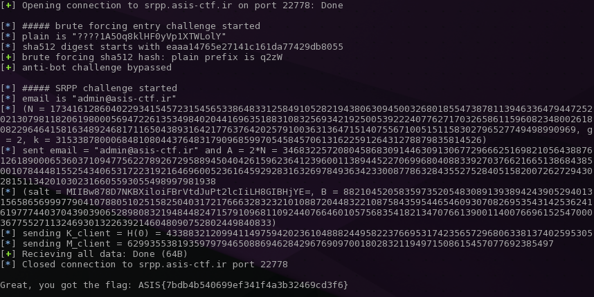

# [ASIS CTF Final 2016](https://asis-ctf.ir): SRPP

**Category:** Crypto
**Points:** 231
**Solves:** 35
**Description:**

> Try to crack our super safe [cryptography system](http://asis-ctf.ir/tasks/srpp.txz_baa9ec300fd3488a8417fc849a07c2aaf5a26224) and find the flag.
>
> nc srpp.asis-ctf.ir 22778

## writeup

This challenge is hacking a well-known, secure cryptosystem by
exploiting a vulnerability in the implementation.

The challenge [txz archive](./srpp.txz_baa9ec300fd3488a8417fc849a07c2aaf5a26224)
contains only the file [server.py](./server.py). Observing this Python
script reveals the following facts:

* the script takes a command line argument that is the listening port of the implemented server,
* the script imports a module named `secret` (which can be implemented as a Python script called [secret.py](./secret.py) in the current dir); the module should contain a `password` and a `flag` variable definition,
* the communication of the server is implemented through simple socket interface (using ascii strings)
* once a connection has been established to the server, a new thread is created,
* the thread 1st gives an easily brute-forcable 4-char SHA512 challenge (probably to prevent brute-forcing on the main part)
* the main part of the thread is a password authentication challenge using the so-called
[Secure Remote Password protocol (SRPP)](https://en.wikipedia.org/wiki/Secure_Remote_Password_protocol)
(it can be identified by analyzing the source code)
* the server gives the flag only if the SRP exchange protocol succeeds (which means basically the client
knows the password stored in the file `secret.py` on the server)

The SRPP is used to authenticate by passwords in a secure manner, so without sharing the passwords.
It works by securely sharing keys derived from the password
(just like [Diffie-Hellman key exchange](https://en.wikipedia.org/wiki/Diffie%E2%80%93Hellman_key_exchange))
Because the SRP protocol is a secure protocol, in theory we could not get the flag without knowing the correct password.
However, this implementation has an easily exploitable vulnerability.

## SRP protocol

To understand the vulnerablity, we have to get familiar a little bit with SRPP.
Note, that all calculations (powers, etc) are done in modulus `N`.

0. The server generates `(N, g, k)` parameters, where `N` is a large (1024-bit)
prime, `g = 2` and `k = H(N, g)` (SRP-6a variant) where `H` is a hashing
function (sha256 here, parameters are joined with a ':' char).
These parameters are shared across the server and the client.

1. The client should send the email address `admin@asis-ctf.ir` (as
a username) and a public random number `A` (as a one time ephermal
key for the client) to the server (<code>A = g<sup>a</sup></code>, where
`a` is a random integer).

2. The server generates a (32-byte) random salt `s` and its public ephermal
random number `B` as <code>B = k*v + g<sup>b</sup></code> where
`b` is a random integer and `v` is the password verifier.
These (`s` and `B`) are shared across the server and the client.
The password verifier is equivalent to the password (with the username):
<code>v = g<sup>x</sup></code>, where `x = H(s, email, password)`.

3. Both sides (the client and the server) calculate `u = H(A, B)`.

4. The server calculates the session
<code>S<sub>s</sub> = (A*v<sup>u</sup>)<sup>b</sup></code>. This is
kept in secret, and hashed: <code>K<sub>server</sub> = H(S<sub>s</sub>)</code>.
<code>K<sub>server</sub></code> is the strong session key of the server.
This should be kept in secret.

5. The client should calculate the session key as follows:
<code>S<sub>c</sub> = (B-kv)<sup>a+ux</sup></code>. The session
key is the hashed value of <code>S<sub>c</sub></code>:
<code>K<sub>client</sub> = H(S<sub>c</sub>)</code>.

6. Note, that if the username and password on the server
and on the client are the same, the session keys should be the same.
Otherwise, if the passwords differ, the session keys almost
certainly differ. Proof of the first statement (not important
for this current challenge, but easy):
<code>
S<sub>c</sub> = (B-kv)<sup>(a+ux)</sup> =
(kv+g<sup>b</sup>-kg<sup>x</sup>)<sup>(a+ux)</sup> =
(kg<sup>x</sup>+g<sup>b</sup>-kg<sup>x</sup>)<sup>(a+ux)</sup> =
(g<sup>b</sup>)<sup>(a+ux)</sup>,
S<sub>s</sub> = (A*v<sup>u</sup>)<sup>b</sup> =
(g<sup>a</sup>v<sup>u</sup>)<sup>b</sup> =
(g<sup>a</sup>*(g<sup>x</sup>)<sup>u</sup>)<sup>b</sup> =
(g<sup>a+ux</sup>)<sup>b</sup> =
(g<sup>b</sup>)<sup>(a+ux)</sup> = S<sub>c</sub>
</code>

7. The session key is kept in secret. To prove that each
party has the same key, the client sends the server
<code>M<sub>client</sub> = H(H(N)^H(g), H(email), s, A, B, K<sub>client</sub>)</code>,
which is verified by the server, and then the server
sends back the client
<code>M<sub>server</sub> = H(A, M<sub>client</sub>, K<sub>server</sub>)</code>,
which is verified by the client.


In this challenge, the server sends `(N, g, k)` to the client (0), 
the client should give the email (as username) and its one
time ephermal (random) key `A` (1). Then the server gives the
salt `s` and its one one time ephermal (random) key `B` (2).

Then the server asks for the session key (5) and verifies
it with its own (4). Furthermore, the client should send
the session key POC, which is also verified (7).

If the verifications pass, the server gives the flag.
Under normal cicumstances, giving the server the
correct session key (and the POC) requires the knowledge
of the password.

## vulnerability

The vulnerability was discovered (in 5 mins ;) ) by
[Towel](https://twitter.com/0xtowel), a great crypto talent,
one of the team members in [OpenToAll](https://ctftime.org/team/9135).
So this writeup is mostly his merit.

To get this protocol work, some conditions must meet the parameters:
<code>A, B &ne; 0 (mod N)</code> and <code>u &ne; 0</code>.

It is easy to see why. Let us see what happens if e.g. `A = 0 (mod N)`.
The session key calculated by the server
<code>S<sub>server</sub> = (A*v<sup>u</sup>)<sup>b</sup> = 0</code>
independently every other parameters (e.g. independently the username
and the password). So <code>K<sub>server</sub> = H(0)</code>,
thus <code>K<sub>client</sub> = H(0)</code> validates independently
the secret password.

However, there is some checking on the one time ephermal key for
the client in the implementation, but it is wrong:

```python
assert (A != 0 and A != N), client.send('Are you kidding me?! :P' + '\n')
```

This check only prohibits `A = 0` and `A = N`, but not e.g. `A = 2*N`,
which is also <code>A &cong; 0 (mod N)</code>.

## exploit

Exploiting the vulnerability now is trivial. Just giving the following
parameters to the server authenticates and it gives the flag (without the
need of the password):

<code>
email = admin@asis-ctf.ir, A = 2*N;
K<sub>client</sub> = H(0);
M<sub>client</sub> = H(H(N) ^ H(g), H(email), salt, A, B, H(0))
</code>

A fully automated Python3 script for this task
is available here in the repo: [client.py](./client.py)

Finally, here is the script in action:

