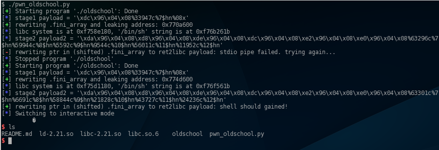

# [CODEGATE CTF 2016](http://codegate.bpsec.co.kr/) : Oldschool

**Category:** pwnable

## writeup

Note, that this writeup has been made after the
competition, but it should work reliable on the
CTF infrastructure as well.

The binary `oldschool` is a general ELF 32-bit executable with
a classical format string bug. The exploit is well
documented in a lot of places, a good old
[paper](https://crypto.stanford.edu/cs155/papers/formatstring-1.2.pdf)
is available at Stanford.

The interesting part is not the vulnerability itself
(reversing and finding the vulnerability is trivial),
but the reliable exploit. The binary has NX enabled,
so simple shellcoding is not possible. Only a ROP or
a simplified ROP-like attack, ret2libc should succeed.

In a classical ret2libc attack the general method is
to rewrite a suitable pointer in the global offsets table
to hijack the execution flow to the desired function
in libc (e.g. `system('/bin/sh')`). And here comes
the interesting part: there is no function called
through the GOT (or PLT) after the vulnerable `printf`
call. Moreover, assuming ASLR enabled, a reliable
exploitation is impossible without leaking some info
before rewriting e.g. a RET ptr on stack or something
else (other than GOT).

Note, that the executable is not PIE, so the binary's
memory regions are mapped to fixed known addresses.
With NX enabled, only one region is writable.
Exploring this region, an interesting part can
be found to rewrite which is called `.fini_array`.
This contains one pointer to `__do_global_dtors_aux`
which is called (by RET) on program termination.
So rewriting this with that vulnerable printf call
should give controlling EIP. ;)

To bypass ASLR and call `system()`, leaking a libc
address is mandatory. This can be done simultaneously
with the rewrite `.fini_array` printf call. After
leaking the address and doing some calculations,
another memory write is needed to hijack the execution
flow to obtain a shell.

So the exploit plan is the following:

1. Exploiting the vulnerable printf
  * leak an address from libc segment, and
  * rewrite ptr in `.fini_array` to restart the program (to `main+4` exactly).
2. Calculate the addresses needed to do the exploit from the leaked libc address:
  * system()
  * '/bin/sh' (exists in libc ;) )
  * exit() to prevent crashing program (and logging the crash to syslog)
3. Exploit again the format string bug to do the ret2libc
(`system('/bin/sh'); exit()`)

Scripting the exploit is not too hard, it needs some
calculation (on printf short writes) and debugging to
obtain the correct offsets.

The repo here contains the original libc from the challenge,
and the [pwn_oldschool.py](./pwn_oldschool.py) exploit script
contains the offsets to use that libc as well.

