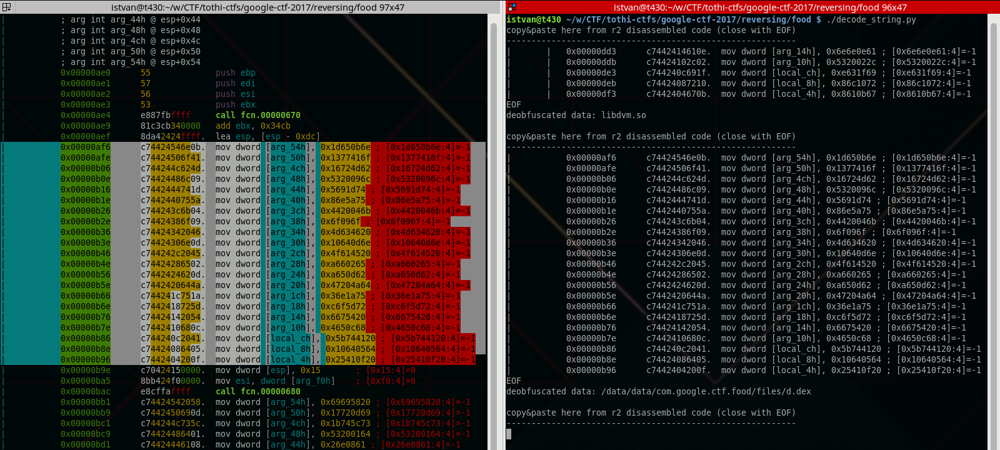
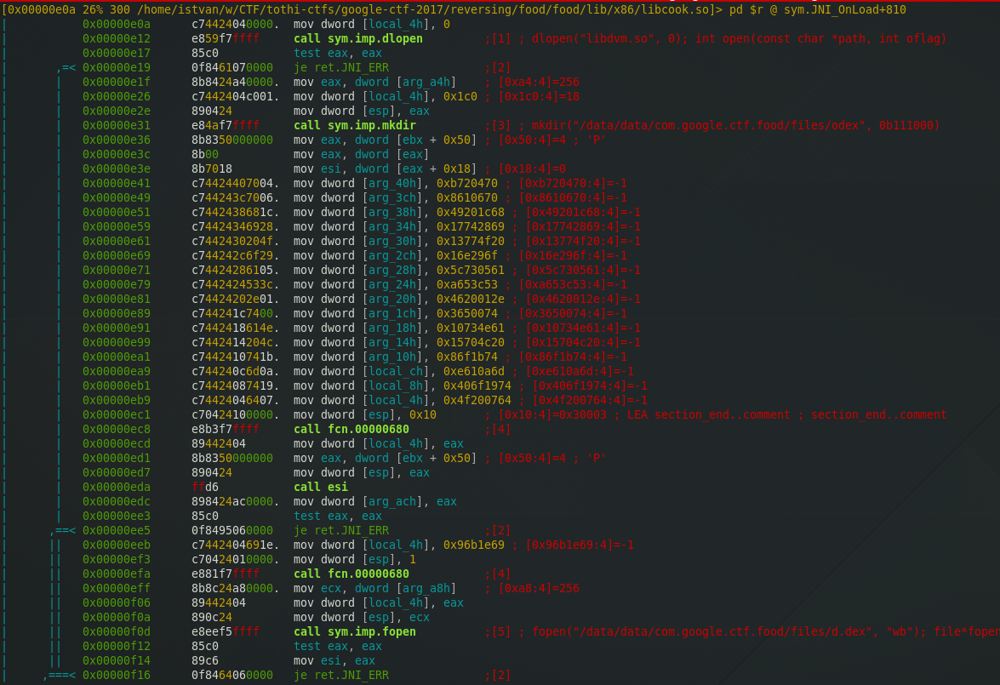
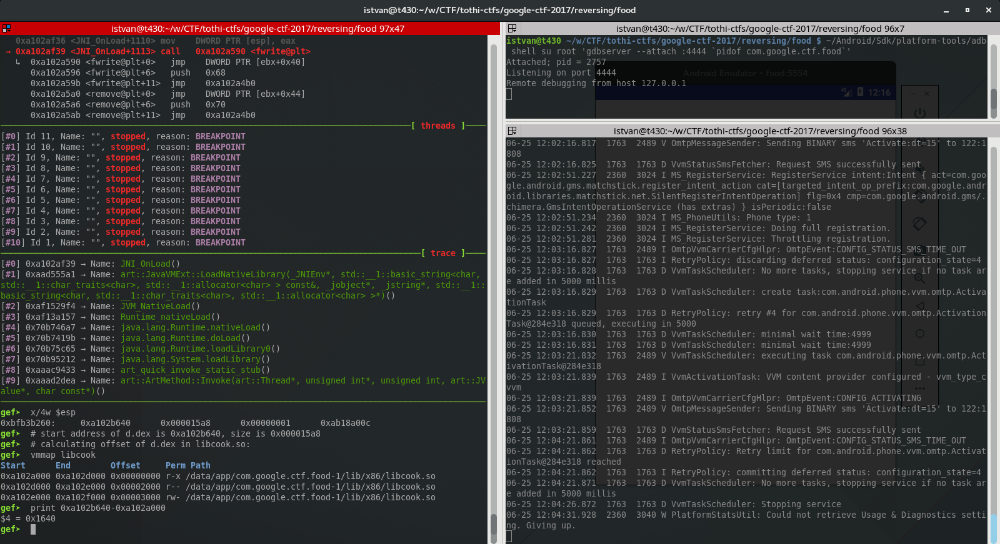
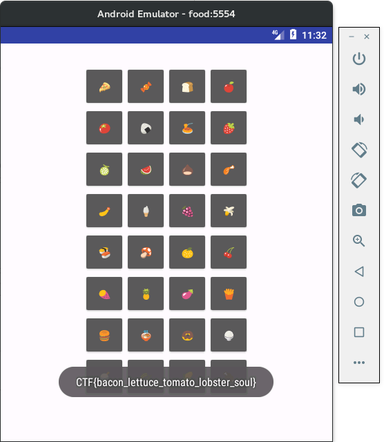

# [Google CTF 2017](https://capturetheflag.withgoogle.com) : Food

**Category:** Reversing
**Points:** 191 (dynamic)
**Solves:** 55
**Difficulty:** Medium
**Description:**

> Android is all about the desserts, but can you come up with the secret recipe > to cook up a flag?
> 
> * [food.apk](./food.apk)


## writeup

The challenge is a classical reverse engineering task. The attached .apk
file should contain the flag, but of course getting it is not straighforward.

For solving the challenge an up-to-date [Gentoo Linux](https://gentoo.org/)
was used, but any other OS supporting the tools used below should work well.

The writeup below does not want to make the shortest path to the solution,
but it wants to show details about Android hacking tools, introduction to
static and dynamic analysis, and much more.

The challenge had been solved in the great team
[OpenToAll](https://ctftime.org/team/9135).
The team finished 30th in the competition.

### analyzing the apk

First (before trying to install and run the apk), it is worth analyzing
the apk with a recent [Apktool](https://ibotpeaches.github.io/Apktool/):

```
$ apktool d food.apk
I: Using Apktool 2.2.2 on food.apk
I: Loading resource table...
I: Decoding AndroidManifest.xml with resources...
I: Loading resource table from file: /home/istvan/.local/share/apktool/framework/1.apk
I: Regular manifest package...
I: Decoding file-resources...
I: Decoding values */* XMLs...
I: Baksmaling classes.dex...
I: Copying assets and libs...
I: Copying unknown files...
I: Copying original files...
```

Analyzing the extracted files, we can find a native lib
`libcook.so` with two versions in subdirs of lib, an `x86` and
an `armeabi` version. (We may hope that the libraries are the
same, so we can use an x86 Android emulator for dealing with the apk
later and drop any arm related stuff. This is much faster on an
x86 host, so this makes our life much easier.)

According to the file `AndroidManifest.xml`, the starting activity
of the apk is `com.google.ctf.food.FoodActivity`.

Apktool disassembles the `classes.dex` bytecode file and organizes
the disassembled `.smali` files under the dir `smali`. There is no
other interesting folder than `smali/com/google/ctf/food`. The
`.smali` code for FoodActivity is in the `FoodActivity.smali` file:

```smali
.class public Lcom/google/ctf/food/FoodActivity;
.super Landroid/support/v7/app/AppCompatActivity;
.source "FoodActivity.java"


# static fields
.field public static activity:Landroid/app/Activity;


# direct methods
.method public constructor <init>()V
    .locals 0

    .prologue
    .line 7
    invoke-direct {p0}, Landroid/support/v7/app/AppCompatActivity;-><init>()V

    return-void
.end method


# virtual methods
.method protected onCreate(Landroid/os/Bundle;)V
    .locals 1
    .param p1, "savedInstanceState"    # Landroid/os/Bundle;

    .prologue
    .line 13
    invoke-super {p0, p1}, Landroid/support/v7/app/AppCompatActivity;->onCreate(Landroid/os/Bundle;)V

    .line 14
    const v0, 0x7f040019

    invoke-virtual {p0, v0}, Lcom/google/ctf/food/FoodActivity;->setContentView(I)V

    .line 15
    sput-object p0, Lcom/google/ctf/food/FoodActivity;->activity:Landroid/app/Activity;

    .line 16
    const-string v0, "cook"

    invoke-static {v0}, Ljava/lang/System;->loadLibrary(Ljava/lang/String;)V

    .line 17
    return-void
.end method
```

After getting familiar with
[basic smali syntax](http://androidcracking.blogspot.hu/2010/09/examplesmali.html)
and [Dalvik bytecodes](https://source.android.com/devices/tech/dalvik/dalvik-bytecode),
it is easy to see that FoodActivity does nothing but
loads the library `libcook.so`.

So the interesting part is surely in `libcook.so`.


### setting up a vm

Before continuing with deeper static analysis, it is worth to try
running the apk in some safe and controllable environment, e.g.
in an emulator.

Because we have an x86 compatible host and the apk (with native libs)
seems to support x86, using an x86 emulator should be the best
option.

Using the official Android emulator provided by Google is preferred.
Note, that android-sdk-update-manager is deprecated, using the
tools supplied with
[Android Studio](https://developer.android.com/studio/index.html) >=2.3 is recommended.

On Gentoo:
```
# emerge dev-util/android-studio
```

First run of the installed Android Studio will download basic
updated Sdk tools to `~/Android/Sdk`. Next,
[get](https://developer.android.com/studio/command-line/sdkmanager.html)
an x86 based system
image (at least API level 23 according to `AndroidManifest.xml`) and
[create](https://developer.android.com/studio/command-line/avdmanager.html)
a dedicated
[Android Virtual Device](https://developer.android.com/studio/run/managing-avds.html)
for the challenge, then
[launch the emulator](https://developer.android.com/studio/run/emulator-commandline.html)
and
[install](https://developer.android.com/studio/command-line/adb.html#move)
the apk:
```
$ ~/Android/Sdk/tools/bin/sdkmanager 'system-images;android-25;google_apis;x86'
$ ~/Android/Sdk/tools/bin/avdmanager create avd -n food -k 'system-images;android-25;google_apis;x86'
$ ~/Android/Sdk/tools/emulator @food -skin 480x600
$ ~/Android/Sdk/platform-tools/adb install food.apk
```

Now running the apk should be possible through the emulator console,
but unfortunately it crashes. Some minor information about the crash
can be obtained by reading the logs:
```
$ adb logcat

...
06-22 00:08:47.708  1496  1800 I ActivityManager: Start proc 2862:com.google.ctf.food/u0a71 for activity com.google.ctf.food/.FoodActivity
...
06-22 00:08:48.266  2862  2862 D AndroidRuntime: Shutting down VM
06-22 00:08:48.266  1496  1941 D ActivityManager: cleanUpApplicationRecord -- 2361
--------- beginning of crash
06-22 00:08:48.266  2862  2862 E AndroidRuntime: FATAL EXCEPTION: main
06-22 00:08:48.266  2862  2862 E AndroidRuntime: Process: com.google.ctf.food, PID: 2862
06-22 00:08:48.266  2862  2862 E AndroidRuntime: java.lang.UnsatisfiedLinkError: JNI_ERR returned from JNI_OnLoad in "/data/app/com.google.ctf.food-1/lib/x86/libcook.so"
06-22 00:08:48.266  2862  2862 E AndroidRuntime: 	at java.lang.Runtime.loadLibrary0(Runtime.java:989)
06-22 00:08:48.266  2862  2862 E AndroidRuntime: 	at java.lang.System.loadLibrary(System.java:1530)
06-22 00:08:48.266  2862  2862 E AndroidRuntime: 	at com.google.ctf.food.FoodActivity.onCreate(FoodActivity.java:16)
06-22 00:08:48.266  2862  2862 E AndroidRuntime: 	at android.app.Activity.performCreate(Activity.java:6679)
06-22 00:08:48.266  2862  2862 E AndroidRuntime: 	at android.app.Instrumentation.callActivityOnCreate(Instrumentation.java:1118)
06-22 00:08:48.266  2862  2862 E AndroidRuntime: 	at android.app.ActivityThread.performLaunchActivity(ActivityThread.java:2618)
06-22 00:08:48.266  2862  2862 E AndroidRuntime: 	at android.app.ActivityThread.handleLaunchActivity(ActivityThread.java:2726)
06-22 00:08:48.266  2862  2862 E AndroidRuntime: 	at android.app.ActivityThread.-wrap12(ActivityThread.java)
06-22 00:08:48.266  2862  2862 E AndroidRuntime: 	at android.app.ActivityThread$H.handleMessage(ActivityThread.java:1477)
06-22 00:08:48.266  2862  2862 E AndroidRuntime: 	at android.os.Handler.dispatchMessage(Handler.java:102)
06-22 00:08:48.266  2862  2862 E AndroidRuntime: 	at android.os.Looper.loop(Looper.java:154)
06-22 00:08:48.266  2862  2862 E AndroidRuntime: 	at android.app.ActivityThread.main(ActivityThread.java:6119)
06-22 00:08:48.266  2862  2862 E AndroidRuntime: 	at java.lang.reflect.Method.invoke(Native Method)
06-22 00:08:48.266  2862  2862 E AndroidRuntime: 	at com.android.internal.os.ZygoteInit$MethodAndArgsCaller.run(ZygoteInit.java:886)
06-22 00:08:48.266  2862  2862 E AndroidRuntime: 	at com.android.internal.os.ZygoteInit.main(ZygoteInit.java:776)
06-22 00:08:48.274  1496  2058 W ActivityManager:   Force finishing activity com.google.ctf.food/.FoodActivity
```

So the apk starts FoodActivity, tries to load `libcook.so`,
and crashes in the init function `JNI_OnLoad` of the library
by returning `JNI_ERR`.


### static analysis

Now it is time to do some static analyisis on `libcook.so`.
Let us choose the x86 version.

```
$ file food/lib/x86/libcook.so
food/lib/x86/libcook.so: ELF 32-bit LSB shared object, Intel 80386, version 1 (SYSV), dynamically linked, stripped, with debug_info
```

Although [IDA](https://www.hex-rays.com/products/ida/) is the
recommended disassembler tool for anything, [r2](http://www.radare.org/r/)
is more than enough for this task now.

```
$ r2 food/lib/x86/libcook.so 
[0x000005c0]> aa
[x] Analyze all flags starting with sym. and entry0 (aa)
[0x000005c0]> afl
0x000004d0    2 16   -> 48   sym.imp.__stack_chk_fail
0x000004e0    2 16   -> 48   sym.imp.__cxa_finalize
0x000004f0    2 16   -> 48   sym.imp.malloc
0x00000500    2 16   -> 48   sym.imp.fopen
0x00000510    2 16   -> 48   sym.imp.strstr
0x00000520    2 16   -> 48   sym.imp.fgets
0x00000530    2 16   -> 48   sym.imp.fclose
0x00000540    2 16   -> 48   sym.imp.sysconf
0x00000550    2 16   -> 48   sym.imp.strtoul
0x00000560    2 16   -> 48   sym.imp.mprotect
0x00000570    2 16   -> 48   sym.imp.dlopen
0x00000580    2 16   -> 48   sym.imp.mkdir
0x00000590    2 16   -> 48   sym.imp.fwrite
0x000005a0    2 16   -> 48   sym.imp.remove
0x000005b0    2 16   -> 48   sym.imp.rmdir
0x000005c0    1 36           entry0
0x00000670    1 4            fcn.00000670
0x00000680    4 137          fcn.00000680
0x00000710   21 971  -> 957  fcn.00000710
0x00000950    1 395          fcn.00000950
0x00000ae0    7 2737         sym.JNI_OnLoad
```

By a quick look at the disassembled code of `JNI_OnLoad` and the function at 680
(`pdf @sym.JNI_OnLoad`, `pdf @fcn.00000680`) we can get the following:

* `JNI_OnLoad` uses obfuscated strings, the decoder function is `fcn.00000680`
* the string decoder function `fcn.00000680` takes two args (on the stack):
a bytearray length, and a bytearray (which is the encoded string data),
and returns a ptr in eax pointing to the decoded string
* JNI_OnLoad checks for some conditions, and jumps to 0x00001580 and returns
-1 (JNI_ERR) in some cases.
* thanks for dynamic linking, we can identify some calls easily, and guess
what is going on: one check is related to open a library (dlopen),
`JNI_OnLoad` tries to make a directory (`mkdir`),
tries to open a file (`fopen`),
tries to write data to file (`fwrite`, `fclose`), and then
probably cleans up everything (`remove`, `rmdir`).

To understand more details, decoding the obfuscated strings is mandatory.

Here is the string decoder function `fcn.00000680` reversed and
implemented in Python:

```python
def decode_string(data, size=-1):
    res = []
    if size == -1: size = len(data)
    for i in range(size):
        v = map(ord, struct.pack("<I", data[i]))
        res.append(~((v[1] | ~v[0]) & (v[0] | ~v[1])))
        res.append(((data[i] >> 16) ^ v[3]) & 0xff)
    return ''.join(map(chr, res))
```

Now decoding the strings in `JNI_OnLoad` is possible.
Made a [helper script](./decode_string.py) for easier and quicker processing:
with this script we can copy&paste the appropriate disassembled
code from r2 and get the decoded string.



Here is a shot of the r2 session
(analyzing, annotating calls, etc. in visual mode):



With the decoded strings we have a much more detailed overview of what is going on:

* the output file is `/data/data/com.google.ctf.food/files/d.dex`,
so `JNI_OnLoad` tries to create a `.dex` file
* this file is removed by JNI_OnLoad, but the contents remain in the
memory
* function `fcn.00000710` is called at the end of JNI_OnLoad (if the
checks passed)
* `fcn.00000710` searches for memory region identified by `/d.dex` in
`/proc/self/maps` and gets the base address
* rewrites a block of the above memory region by some static data
stored in `libcook.so` (xored by 0x5a)
* invokes the class in `d.dex`

So we should try to get (the patched) `d.dex` somehow, and analyse it.

Although `d.dex` could be extracted by pure static analysis,
now the time has come to do some dynamic debugging. ;)


### dynamic debugging

We should try to debug the native shared library `libcook.so` on the
Android (virtual) device. The preferred method should be attaching
[gdbserver](https://en.wikipedia.org/wiki/Gdbserver) to the process
on Android and use [gdb](https://www.gnu.org/software/gdb/)
on the host system.

Attaching gdbserver needs some preparation, because we cannot launch
the apk directly by gdbserver, and attaching is not trivial, because the
apk exits from `JNI_OnLoad` (by `JNI_ERR`) in the native lib very quickly.

#### patching the apk

In order to attach gdbserver, we have to force the apk to wait for a short
time before loading the library. This can be done easily by patching the
apk:

* unpack and disassemble with [Apktool](https://ibotpeaches.github.io/Apktool/)
* patch `food/smali/com/google/ctf/food/FoodActivity.smali` by adding a call
to [android.os.SystemClock.sleep(0x8000)](https://developer.android.com/reference/android/os/SystemClock.html)
before the `java.lang.System.loadLibrary("cook")` call forcing the app to wait for
0x8000 ms (~32 secs) which makes it possible to attach gdbserver
* assemble and pack the apk with [Apktool](https://ibotpeaches.github.io/Apktool/)
* and do not forget to sign the apk with
[jarsigner](http://docs.oracle.com/javase/8/docs/technotes/tools/unix/jarsigner.html)
(and [keytool](http://docs.oracle.com/javase/8/docs/technotes/tools/unix/keytool.html)) found in
[JDK](https://docs.oracle.com/javase/8/docs/technotes/tools/index.html#security).

The steps to perform in details:
```
$ apktool d food.apk
$ sed -e '24 s/\.locals 1/.locals 2/' \
      -e '38 i \\n    const-wide/32 v0, 0x8000' \
      -e '38 i \    invoke-static {v0, v1}, Landroid/os/SystemClock;->sleep(J)V' \
      -i food/smali/com/google/ctf/food/FoodActivity.smali
$ apktool b food
$ cp ./food/dist/food.apk ./food-sleep.apk
$ keytool -genkey -alias food -keystore googlectf2017.keystore
$ jarsigner -keystore googlectf2017.keystore food-sleep.apk food
```

Now `food-sleep.apk` is ready for installing and attaching gdbserver.


#### attaching gdb

Launch the emulator (if it is not running):
```
$ ~/Android/Sdk/tools/emulator @food -skin 800x600
```

And install the apk (probably first uninstalling the previous
one is needed, because it has different signature):
```
$ ~/Android/Sdk/platform-tools/adb uninstall com.google.ctf.food
$ ~/Android/Sdk/platform-tools/adb install food-sleep.apk
```

For remote (host->vm) debugging, forward local 4444/tcp port to
4444/tcp on the vm, start the app (directly on vm console or using cmdline
[activity manager](https://developer.android.com/studio/command-line/adb.html#am))
and attach gdbserver quickly (in 30 secs) to catch the app running:
```
$ ~/Android/Sdk/platform-tools/adb forward tcp:4444 tcp:4444
$ ~/Android/Sdk/platform-tools/adb shell am start com.google.ctf.food/com.google.ctf.food.FoodActivity
Starting: Intent { act=android.intent.action.MAIN cat=[android.intent.category.LAUNCHER] cmp=com.google.ctf.food/.FoodActivity }
$ ~/Android/Sdk/platform-tools/adb shell su root 'gdbserver --attach :4444 `pidof com.google.ctf.food`'
```

If everything is ok, gdbserver on the vm should control the Android app
and is ready to connect. Run gdb on the host:

```
$ gdb -ex 'target remote :4444'
```

Now debugging should work. Note, that we are still in the Dalvik VM
(or more precisely, in the
[Android Runtime](https://en.wikipedia.org/wiki/Android_Runtime)
env), we have to jump to the native library:

```
gef➤  break JNI_OnLoad 
Breakpoint 1 at 0xa4112a74 (6 locations)
gef➤  continue
Continuing.
Reading /data/app/com.google.ctf.food-1/lib/x86/libcook.so from remote target...

Breakpoint 1, 0xa7e28ae0 in JNI_OnLoad () from target:/data/app/com.google.ctf.food-1/lib/x86/libcook.so
──────────────────────────────────────────────────────────────────────[ registers ]────
$eax   : 0xae3fd440  →  0x00000000
$ebx   : 0xae3fbb74  →  0x0073aa74
$ecx   : 0x00590000
$edx   : 0x00000000
$esp   : 0xbf899d3c  →  0xae0555a1  →  <art::JavaVMExt::LoadNativeLibrary(_JNIEnv*,+0> mov edi, eax
$ebp   : 0xbf899e48  →  0xbf899eb8  →  0xbf899ed8  →  0x70b74187  →  <java.lang.Runtime.doLoad+147> pop eax
$esi   : 0xae4b00c0  →  0xae3f4814  →  0x00000000
$edi   : 0xa7e28ae0  →  0x53565755 ("UWVS"?)
$eip   : 0xa7e28ae0  →  0x53565755 ("UWVS"?)
$cs    : 0x00000073
$ss    : 0x0000007b
$ds    : 0x0000007b
$es    : 0x0000007b
$fs    : 0x0000003b
$gs    : 0x00000033
$eflags: [carry PARITY adjust ZERO sign trap INTERRUPT direction overflow resume virtualx86 identification]
──────────────────────────────────────────────────────────────────────[ stack ]────
0xbf899d3c│+0x00: 0xae0555a1  →  <art::JavaVMExt::LoadNativeLibrary(_JNIEnv*,+0> mov edi, eax	 ← $esp
0xbf899d40│+0x04: 0xae4b00c0  →  0xae3f4814  →  0x00000000
0xbf899d44│+0x08: 0x00000000
0xbf899d48│+0x0c: 0x00000000
0xbf899d4c│+0x10: 0xbf899e04  →  0xa55d9880  →  0x00000041 ("A"?)
0xbf899d50│+0x14: 0xb26331d0  →  "libcook.so"
0xbf899d54│+0x18: 0xbf899f14  →  0x12c4b250  →  0x6fd85980  →  0x6fbcbf00  →  0x6fbcbf00  →  [loop detected]
0xbf899d58│+0x1c: 0xa68500c0  →  0xae3f4780  →  0xaddde850  →  <art::Mutex::IsMutex()+0> push ebp
────────────────────────────────────────────────────────────────────[ code:i386 ]────
   0xa7e28ad8                  pop    edi
   0xa7e28ad9                  pop    ebp
   0xa7e28ada                  ret    
   0xa7e28adb                  nop    
   0xa7e28adc                  lea    esi, [esi+eiz*1+0x0]
 → 0xa7e28ae0 <JNI_OnLoad+0>   push   ebp
   0xa7e28ae1 <JNI_OnLoad+1>   push   edi
   0xa7e28ae2 <JNI_OnLoad+2>   push   esi
   0xa7e28ae3 <JNI_OnLoad+3>   push   ebx
   0xa7e28ae4 <JNI_OnLoad+4>   call   0xa7e28670
   0xa7e28ae9 <JNI_OnLoad+9>   add    ebx, 0x34cb
───────────────────────────────────────────────────────────────────[ threads ]────
[#0] Id 11, Name: "", stopped, reason: BREAKPOINT
[#1] Id 10, Name: "", stopped, reason: BREAKPOINT
[#2] Id 9, Name: "", stopped, reason: BREAKPOINT
[#3] Id 8, Name: "", stopped, reason: BREAKPOINT
[#4] Id 7, Name: "", stopped, reason: BREAKPOINT
[#5] Id 6, Name: "", stopped, reason: BREAKPOINT
[#6] Id 5, Name: "", stopped, reason: BREAKPOINT
[#7] Id 4, Name: "", stopped, reason: BREAKPOINT
[#8] Id 3, Name: "", stopped, reason: BREAKPOINT
[#9] Id 2, Name: "", stopped, reason: BREAKPOINT
[#10] Id 1, Name: "", stopped, reason: BREAKPOINT
────────────────────────────────────────────────────────────────────[ trace ]────
[#0] 0xa7e28ae0 → Name: JNI_OnLoad()
[#1] 0xae0555a1 → Name: art::JavaVMExt::LoadNativeLibrary(_JNIEnv*, std::__1::basic_string<char, std::__1::char_traits<char>, std::__1::allocator<char> > const&, _jobject*, _jstring*, std::__1::basic_string<char, std::__1::char_traits<char>, std::__1::allocator<char> >*)()
[#2] 0xb24359f4 → Name: JVM_NativeLoad()
[#3] 0xb241d157 → Name: Runtime_nativeLoad()
[#4] 0x70b746a7 → Name: java.lang.Runtime.nativeLoad()
[#5] 0x70b7419b → Name: java.lang.Runtime.doLoad()
[#6] 0x70b75c65 → Name: java.lang.Runtime.loadLibrary0()
[#7] 0x70b95212 → Name: java.lang.System.loadLibrary()
[#8] 0xaddc9433 → Name: art_quick_invoke_static_stub()
[#9] 0xaddd2dea → Name: art::ArtMethod::Invoke(art::Thread*, unsigned int*, unsigned int, art::JValue*, char const*)()
────────────────────────────────────────────────────────────────────────────
gef➤  
```

Using some GDB enhancement plugin such as [GEF](http://gef.readthedocs.io/en/latest/)
is recommended.

#### debugging the native library

So the program flow is paused in the start of `libcook.so` at `JNI_OnLoad+0`.

First critical check seems to be after the `dlopen` call. Placing a breakpoint
on that call, we can see the arguments: `dlopen("libdvm.so", 0)`. The call
returns with 0 (unsuccessful), and the library exits with `JNI_ERR`.
To override the conditional jump on
the `je` operand, we can set `$eip` to the next instruction, or simply clear
the zero flag (the 6th bit of `$eflags`):

```
gef➤  set $eflags &= ~(1 << 6)
```

The next call is `mkdir("/data/data/com.google.ctf.food/files/odex", 0b11100)`,
then shortly afterwards
`fopen("/data/data/com.google.ctf.food/files/d.dex", "wb")`.
This will fail surely (and app exits again with JNI_ERR),
because the parent dir `files` does not exist. Let us create it in ADB shell:

```
$ ~/Android/Sdk/platform-tools/adb shell
generic_x86:/ $ su
generic_x86:/ # cd /data/data/com.google.ctf.food
generic_x86:/data/data/com.google.ctf.food # ls -al
total 40
drwxr-x--x  4 u0_a71 u0_a71 4096 2017-06-22 22:59 .
drwxrwx--x 94 system system 4096 2017-06-22 22:52 ..
drwxrwx--x  2 u0_a71 u0_a71 4096 2017-06-22 22:52 cache
drwxrwx--x  2 u0_a71 u0_a71 4096 2017-06-22 22:52 code_cache
lrwxrwxrwx  1 root   root     39 2017-06-22 22:52 lib -> /data/app/com.google.ctf.food-1/lib/x86
generic_x86:/data/data/com.google.ctf.food # mkdir files
generic_x86:/data/data/com.google.ctf.food # chown u0_a71:u0_a71 files
generic_x86:/data/data/com.google.ctf.food # ls -al
total 48
drwxr-x--x  5 u0_a71 u0_a71 4096 2017-06-22 23:01 .
drwxrwx--x 94 system system 4096 2017-06-22 22:52 ..
drwxrwx--x  2 u0_a71 u0_a71 4096 2017-06-22 22:52 cache
drwxrwx--x  2 u0_a71 u0_a71 4096 2017-06-22 22:52 code_cache
drwxrwxrwx  2 u0_a71 u0_a71 4096 2017-06-22 23:01 files
lrwxrwxrwx  1 root   root     39 2017-06-22 22:52 lib -> /data/app/com.google.ctf.food-1/lib/x86
```

Unfortunately the `fopen` (and `mkdir`) call still fails.
But now an interesting entry is created in the log:
```
06-22 23:05:57.338  3615  3615 W google.ctf.food: type=1400 audit(0.0:36): avc: denied { search } for name="files" dev="vdc" ino=8405 scontext=u:r:untrusted_app:s0:c512,c768 tcontext=u:object_r:app_data_file:s0 tclass=dir permissive=0
```

This means that the
[SELinux](https://en.wikipedia.org/wiki/Security-Enhanced_Linux)
policy blocks accessing that folder. To understand, why:

```
$ ~/Android/Sdk/platform-tools/adb shell
generic_x86:/ $ su
generic_x86:/ # ls -lZ /data/data/com.google.ctf.food
total 24
drwxrwx--x 2 u0_a71 u0_a71 u:object_r:app_data_file:s0:c512,c768 4096 2017-06-22 22:52 cache
drwxrwx--x 2 u0_a71 u0_a71 u:object_r:app_data_file:s0:c512,c768 4096 2017-06-22 22:52 code_cache
drwxrwxrwx 2 u0_a71 u0_a71 u:object_r:app_data_file:s0           4096 2017-06-22 23:01 files
lrwxrwxrwx 1 root   root   u:object_r:app_data_file:s0             39 2017-06-22 22:52 lib -> /data/app/com.google.ctf.food-1/lib/x86
generic_x86:/ # ps -Z `pidof com.google.ctf.food`
LABEL                          USER      PID   PPID  VSIZE  RSS   WCHAN            PC  NAME
u:r:untrusted_app:s0:c512,c768 u0_a71    3615  1297  990932 37496 ptrace_sto a250ae37 t com.google.ctf.food
```

Probably `app_data_file` is not allowed for `untrusted_app` domain,
but setting the same categories (c512,c768) as in the app context will
allow access to the `files` dir. In ADB shell:
```
generic_x86:/ # chcon u:object_r:app_data_file:s0:c512,c768 /data/data/com.google.ctf.food/files
generic_x86:/ # ls -Zal /data/data/com.google.ctf.food/                                                                                                                                             
total 48
drwxr-x--x  5 u0_a71 u0_a71 u:object_r:app_data_file:s0:c512,c768 4096 2017-06-22 23:01 .
drwxrwx--x 94 system system u:object_r:system_data_file:s0        4096 2017-06-22 22:52 ..
drwxrwx--x  2 u0_a71 u0_a71 u:object_r:app_data_file:s0:c512,c768 4096 2017-06-22 22:52 cache
drwxrwx--x  2 u0_a71 u0_a71 u:object_r:app_data_file:s0:c512,c768 4096 2017-06-22 22:52 code_cache
drwxrwxrwx  3 u0_a71 u0_a71 u:object_r:app_data_file:s0:c512,c768 4096 2017-06-23 00:07 files
lrwxrwxrwx  1 root   root   u:object_r:app_data_file:s0             39 2017-06-22 22:52 lib -> /data/app/com.google.ctf.food-1/lib/x86
```

After restarting the whole debugging process (restart app, attach gdbserver,
connect from host gdb, break on `JNI_OnLoad`, bypass `dlopen` check),
the mkdir should execute flawlessly:

```
generic_x86:/ # ls -Zl /data/data/com.google.ctf.food/files/                                                  
total 8
drwx------ 2 u0_a71 u0_a71 u:object_r:app_data_file:s0:c512,c768 4096 2017-06-23 00:07 odex
```

Now `fopen`, `fwrite` and `fclose` should work as well.
We can get the file `d.dex` by setting a breakpoint after `fclose`:

```
$ ~/Android/Sdk/platform-tools/adb shell 'su root cat /data/data/com.google.ctf.food/files/d.dex' > d.dex
```

Of course dumping `d.dex` directly from `libcook.so` is also possible.
If we set a breakpoint on `fwrite`, we can catch the parameters, so the
location of `d.dex` in `libcook.so` can be obtained easily:
it is at offset `0x1640` with length `0x15a8`.

Here is a shot of how dynamic debugging helps:


But probably this is not the final version of what we want, because
the app patches `d.dex` later (in the memory) in function `fcn.00000710`.

Anyway, we can continue until the last call in `JNI_OnLoad`
(which jumps to `fcn.00000710`),
all of the checks get passed without exiting with `JNI_ERR`.
Meanwhile, the system calls `dex2oat` and we can see that the
[DEX (Dalvik EXecutable)](https://en.wikipedia.org/wiki/Dalvik_(software))
in memory gets compiled to optimized
[ART (Android RunTime)](https://en.wikipedia.org/wiki/Android_Runtime).

Stepping into `fcn.00000710` reveals the following:

* the function finds memory region identified by `/d.dex`
* searches for string `dex\n0` in the region and applies the patch
only if that string was found
* the patch data absolute address can be calculated easily
by `print $ebx-0x2a14` and the offset in `libcook.so` can be
seen by looking at the library base address issuing the cmd
`vmmap` in gdb
* so the patch offset in `libcook.so` is `0x15a0`, the xor
value to be used is `0x5a`, the length of the patch is 144 bytes
and the target offset in `d.dex` is `0x720`.
* the patch is not applied in the above flow (because d.dex
was compiled to ART), but continuing is possible.

After continuing, a graphical 4x8 matrix of food icon buttons
appears on the vm console. Pushing the buttons is possible,
but nothing interesting happens...

Maybe it is time to switch to static analysis, again.
We have the `d.dex` file, so we may try to decompile it
(and/or apply the patch manually, and decompile the patched version).


### analyzing the DEX file

There are nice tools to decompile a Dalvik EXecutable (DEX) file
to Java Source, a recommended one is
[JADX - Dex to Java decompiler](https://github.com/skylot/jadx).

```
$ jadx -d d_jadx d.dex
```

After decompiling, we have classes `F`, `R`, `ℝ` and `S` in
package `com.google.ctf.food`. The method `cc` in class `F`
seems to be buggy, because there are just a lot of repeating return
instructions in it. This may imply that the patch is mandatory.

#### patching d.dex

The manual patch is trivial because we have obtained all the necessary
parameters above during dynamic analysis. Here is a snippet that does
the patch ([patch_dex.py](./patch_dex.py) here in the repo):

```python
#!/usr/bin/python2
#

libcook = open('./food/lib/x86/libcook.so', 'rb')
libcook.seek(0x15a0)
patchdata = libcook.read(0x90)

# getting the dex from the dumped file
#orig_dex = open('./d.dex', 'rb').read()

# or get it directly from libcook.so
libcook.seek(0x1640)
orig_dex = libcook.read(0x15a8)

patched_dex = open('./d_patched.dex', 'wb')
patched_dex.write(orig_dex[:0x720])
patched_dex.write(''.join(map(lambda x: chr(ord(x)^0x5a), patchdata)))
patched_dex.write(orig_dex[0x720+0x90:])
patched_dex.close()
libcook.close()
```

So applying the patch and decompiling again; jadx runs
without any errors:
```
$ ./patch_dex.py
$ ./jadx/bin/jadx -d d_patched_jadx d_patched.dex 
02:33:16 INFO  - loading ...
02:33:16 INFO  - processing ...
02:33:17 INFO  - done
```

### static analysis of the Java Source: getting the flag

Now getting the flag is very close. We just have to understand
what does the Java code do. There are 4 class members in the
package com.google.ctf.food:

* class S draws 32 food objects (as clickable buttons) on the
screen and sends the pushed food item ids to class F.
* class F receives the ids broadcasted from class S, and
validates the ids with some hardcoded values in method `F.cc()`.
* if ids matched, pass them to `ℝ.ℂ()` and get the flag.

Here is F.cc():

```java
    public void cc() {
        byte[] bArr = new byte[]{(byte) 26, (byte) 27, (byte) 30, (byte) 4, (byte) 21, (byte) 2, (byte) 18, (byte) 7};
        for (int i = 0; i < 8; i++) {
            bArr[i] = (byte) (bArr[i] ^ this.k[i]);
        }
        if (new String(bArr).compareTo("\u0013\u0011\u0013\u0003\u0004\u0003\u0001\u0005") == 0) {
            Toast.makeText(this.a.getApplicationContext(), new String(ℝ.ℂ(flag, this.k)), 1).show();
        }
    }
```

Reusing the original Java code, just by adding a modified
version of F.cc(), we can get the flag immediately.
The full source of [Solve.java](./Solve.java):
```java
import com.google.ctf.food.ℝ;

/* original F.cc()
class F {
    ...

    public void cc() {
        byte[] bArr = new byte[]{(byte) 26, (byte) 27, (byte) 30, (byte) 4, (byte) 21, (byte) 2, (byte) 18, (byte) 7};
        for (int i = 0; i < 8; i++) {
            bArr[i] = (byte) (bArr[i] ^ this.k[i]);
        }
        if (new String(bArr).compareTo("\u0013\u0011\u0013\u0003\u0004\u0003\u0001\u0005") == 0) {
            Toast.makeText(this.a.getApplicationContext(), new String(ℝ.ℂ(flag, this.k)), 1).show();
        }
    }
}
*/

// call modified F.cc() to output the flag
public class Solve {

    // unmodified from class F
    private static byte[] flag = new byte[]{(byte) -19, (byte) 116, (byte) 58, (byte) 108, (byte) -1, (byte) 33, (byte) 9, (byte) 61, (byte) -61, (byte) -37, (byte) 108, (byte) -123, (byte) 3, (byte) 35, (byte) 97, (byte) -10, (byte) -15, (byte) 15, (byte) -85, (byte) -66, (byte) -31, (byte) -65, (byte) 17, (byte) 79, (byte) 31, (byte) 25, (byte) -39, (byte) 95, (byte) 93, (byte) 1, (byte) -110, (byte) -103, (byte) -118, (byte) -38, (byte) -57, (byte) -58, (byte) -51, (byte) -79};

    // simply calculate k from the expected result (compareTo)
    // modified from F.cc()
    public static byte[] cc() {
	byte[] k = new byte[8];
        byte[] bArr = new byte[]{(byte) 26, (byte) 27, (byte) 30, (byte) 4, (byte) 21, (byte) 2, (byte) 18, (byte) 7};
	byte[] compareTo = new byte[]{(byte) 0x13, (byte) 0x11, (byte) 0x13, (byte) 0x3, (byte) 0x4, (byte) 0x3, (byte) 0x1, (byte) 0x5};
        for (int i = 0; i < 8; i++) {
            k[i] = (byte) (bArr[i] ^ compareTo[i]);
	    System.out.format("%d ", k[i]);  // output food ids as well
        }
	System.out.println();
	return ℝ.ℂ(flag, k);
    }
    
    public static void main(String[] args) {
        System.out.println(new String(cc()));
    }
}
```

Compiling and running Solve.java gives the flag:
```
$ javac -cp .:./d_patched_jadx/ Solve.java
$ java  -cp .:./d_patched_jadx/ Solve
9 10 13 7 17 1 19 2 
CTF{bacon_lettuce_tomato_lobster_soul}
```

### alternative solution: cook up the flag

We got the flag, but it would be nice to get the patched
dex running and make it show the flag when pressed the right
food button icons in order.

The right order of the food buttons can be obtained by
analyzing the source code of the above patched `d.dex` file.
Method `F.cc()` in `com.google.ctf.food` validates the clicks
by xoring the ids with `bArr` and checking against a
unicode string. Sorting the equation, this means the
ids (k) in order should be `bArr` xored with that unicode string:

```
k = [9 10 13 7 17 1 19 2]
```

Note, that the class Solve above dumps this array as well.
The ids start from 0 and grow row by row when displaying
the food icon matrix. Furthermore, looking at class S,
the ids can be translated to food icons:

```
🍉 🌰 🍦 🍓 🍄 🍬 🍒 🍞
```

So these buttons should be pressed in order (aka this is the recipe),
and then the flag should be displayed.

However, it is important, that the patched `d.dex` should be used.
And the patch will not be performed in the normal program flow,
because the app tries to patch the dex _after_ it was compiled
to oat. A simple workaround for this is to replace the `d.dex`
file with the patched one immediately after it was written
to the fs. This can be done by setting a breakpoint after `fclose()`
with the attached gdb, then the file `d.dex` can be replaced
by the (manually) patched one (see above).

To make this work, `.dex`
[header items](https://source.android.com/devices/tech/dalvik/dex-format)
(adler32 checksum and sha1 hash) of the patched dex must be recalculated,
otherwise `dex2oat` fails and the app aborts.

r2 not just supports `.dex` files (for disassembling), but knows
adler32 and other hash algorithms, and gives advice about how to fix
`.dex` with invalid checksums:

```
$ ./patch_dex.py           # creates d_patched.dex
$ r2 -w ./d_patched.dex    # loads d_patched.dex into radare2 (in write mode)
# adler32 checksum doesn't match. Type this to fix it:
wx `#sha1 $s-32 @32` @12 ; wx `#adler32 $s-12 @12` @8
[0x00000688]> wx `ph sha1 $s-32 @32` @12
[0x00000688]> wx `ph adler32 $s-12 @12` @8
[0x00000688]> q
$ r2 d_patched.dex         # load again (just for testing)
[0x00000688]> q
```

Now `d_patched.dex` is a valid `.dex` file.

Let us start everything from scratch. Launch the emulator and start displaying log:
```
$ ~/Android/Sdk/tools/emulator @food -skin 480x600 &
$ ~/Android/Sdk/platform-tools/adb logcat
```

Start the app and attach `gdbserver` (within 30 secs):
```
$ ~/Android/Sdk/platform-tools/adb shell am start com.google.ctf.food/com.google.ctf.food.FoodActivity
Starting: Intent { act=android.intent.action.MAIN cat=[android.intent.category.LAUNCHER] cmp=com.google.ctf.food/.FoodActivity }
$ ~/Android/Sdk/platform-tools/adb shell su root 'gdbserver --attach :4444 `pidof com.google.ctf.food`'
Attached; pid = 3060
Listening on port 4444
```

Forward host tcp port 4444 to emulator tcp port 4444
and connect `gdb`:
```
$ ~/Android/Sdk/platform-tools/adb forward tcp:4444 tcp:4444
$ gdb -ex 'target remote :4444'
```

Break on `JNI_OnLoad` in gdb:
```
gef➤  break JNI_OnLoad 
Breakpoint 1 at 0xa4112a74 (6 locations)
gef➤  continue
Continuing.
Reading /data/app/com.google.ctf.food-1/lib/x86/libcook.so from remote target...

Breakpoint 1, 0xa7e28ae0 in JNI_OnLoad () from target:/data/app/com.google.ctf.food-1/lib/x86/libcook.so
...
────────────────────────────────────────────────────────────
gef➤  
```

Bypass `dlopen("libdvm.so", 0)` check and break after `fclose()`:
```
gef➤  x/6i 0xa7e28e07
   0xa7e28e07 <JNI_OnLoad+807>:	mov    DWORD PTR [esp],eax
   0xa7e28e0a <JNI_OnLoad+810>:	mov    DWORD PTR [esp+0x4],0x0
   0xa7e28e12 <JNI_OnLoad+818>:	call   0xa7e28570 <dlopen@plt>
   0xa7e28e17 <JNI_OnLoad+823>:	test   eax,eax
   0xa7e28e19 <JNI_OnLoad+825>:	je     0xa7e29580 <JNI_OnLoad+2720>
   0xa7e28e1f <JNI_OnLoad+831>:	mov    eax,DWORD PTR [esp+0xa4]
gef➤  break *0xa7e28e17
Breakpoint 2 at 0xa7e28e17
gef➤  continue 
Continuing.

Breakpoint 2, 0xa7e28e17 in JNI_OnLoad () from target:/data/app/com.google.ctf.food-1/lib/x86/libcook.so
────────────────────────────────────────────────[ registers ]────────────
$eax   : 0x00000000
...
────────────────────────────────────────────────[ code:i386 ]────────────
...
   0xa7e28e0a <JNI_OnLoad+810> mov    DWORD PTR [esp+0x4], 0x0
   0xa7e28e12 <JNI_OnLoad+818> call   0xa7e28570 <dlopen@plt>
 → 0xa7e28e17 <JNI_OnLoad+823> test   eax, eax
   0xa7e28e19 <JNI_OnLoad+825> je     0xa7e29580 <JNI_OnLoad+2720>
   0xa7e28e1f <JNI_OnLoad+831> mov    eax, DWORD PTR [esp+0xa4]
...
────────────────────────────────────────────────────────────
gef➤  set $eax=1
gef➤  x/8i 0xa7e28f20
   0xa7e28f20 <JNI_OnLoad+1088>:	lea    eax,[ebx-0x2974]
   0xa7e28f26 <JNI_OnLoad+1094>:	mov    DWORD PTR [esp+0x8],0x1
   0xa7e28f2e <JNI_OnLoad+1102>:	mov    DWORD PTR [esp+0x4],0x15a8
   0xa7e28f36 <JNI_OnLoad+1110>:	mov    DWORD PTR [esp],eax
   0xa7e28f39 <JNI_OnLoad+1113>:	call   0xa7e28590 <fwrite@plt>
   0xa7e28f3e <JNI_OnLoad+1118>:	mov    DWORD PTR [esp],esi
   0xa7e28f41 <JNI_OnLoad+1121>:	call   0xa7e28530 <fclose@plt>
   0xa7e28f46 <JNI_OnLoad+1126>:	mov    eax,DWORD PTR [ebx+0x50]
gef➤  break *0xa7e28f46
Breakpoint 3 at 0xa7e28f46
gef➤  continue
Continuing.

Breakpoint 3, 0xa7e28f46 in JNI_OnLoad () from target:/data/app/com.google.ctf.food-1/lib/x86/libcook.so
...
─────────────────────────────────────────────────[ code:i386 ]────
   0xa7e28f36 <JNI_OnLoad+1110> mov    DWORD PTR [esp], eax
   0xa7e28f39 <JNI_OnLoad+1113> call   0xa7e28590 <fwrite@plt>
   0xa7e28f3e <JNI_OnLoad+1118> mov    DWORD PTR [esp], esi
   0xa7e28f41 <JNI_OnLoad+1121> call   0xa7e28530 <fclose@plt>
 → 0xa7e28f46 <JNI_OnLoad+1126> mov    eax, DWORD PTR [ebx+0x50]
   0xa7e28f4c <JNI_OnLoad+1132> mov    eax, DWORD PTR [eax]
...
────────────────────────────────────────────────────────────
```

Now overwrite `d.dex` with the patched one in the emulator
and fix permissions (with SELinux context):
```
$ ~/Android/Sdk/platform-tools/adb shell rm /data/data/com.google.ctf.food/files/d.dex
$ cat d_patched.dex | ~/Android/Sdk/platform-tools/adb shell su root cat \> /data/data/com.google.ctf.food/files/d.dex
$ ~/Android/Sdk/platform-tools/adb shell
generic_x86:/ $ su
generic_x86:/ # cd /data/data/com.google.ctf.food/files                                                                                                     generic_x86:/data/data/com.google.ctf.food/files # ls -alZ
total 48
drwxrwxrwx 3 u0_a71 u0_a71 u:object_r:app_data_file:s0:c512,c768 4096 2017-06-24 23:26 .
drwxr-x--x 5 u0_a71 u0_a71 u:object_r:app_data_file:s0:c512,c768 4096 2017-06-24 23:04 ..
-rw-rw-rw- 1 shell  shell  u:object_r:app_data_file:s0           5544 2017-06-24 23:26 d.dex
drwx------ 2 u0_a71 u0_a71 u:object_r:app_data_file:s0:c512,c768 4096 2017-06-24 23:15 odex
generic_x86:/data/data/com.google.ctf.food/files # chown u0_a71:u0_a71 d.dex
generic_x86:/data/data/com.google.ctf.food/files # chcon u:object_r:app_data_file:s0:c512,c768 d.dex
```

If everything is ok, continuing execution flow will launch
the patched `d.dex`:
```
gef➤  continue
Continuing.
Reading /data/data/com.google.ctf.food/files/odex/d.dex from remote target...
[New Thread 3514]
Reading /system/lib/hw/gralloc.ranchu.so from remote target...
Reading /system/lib/hw/.debug/gralloc.ranchu.so from remote target...
Reading /system/lib/libOpenglSystemCommon.so from remote target...
Reading /system/lib/.debug/libOpenglSystemCommon.so from remote target...
Reading /system/lib/libGLESv2_enc.so from remote target...
Reading /system/lib/.debug/libGLESv2_enc.so from remote target...
Reading /system/lib/lib_renderControl_enc.so from remote target...
Reading /system/lib/.debug/lib_renderControl_enc.so from remote target...
Reading /system/lib/libGLESv1_enc.so from remote target...
Reading /system/lib/.debug/libGLESv1_enc.so from remote target...
Reading /system/lib/hw/gralloc.default.so from remote target...
Reading /system/lib/hw/.debug/gralloc.default.so from remote target...
```

Now it is time to interact with the graphical console of the
emulator: press the food button icons in the right order.




### final: making things much easier ;)

We should answer to a basic question what can make things much easier:
why the patch to the `.dex` does not apply in `fcn.00000710`?

Because the `.dex` gets compiled to [Android Runtime](https://en.wikipedia.org/wiki/Android_Runtime) (by `dex2oat`).
Note, that Android Runtime (ART) had been introduced in
[Android 4.4 KitKat (API 19)](https://en.wikipedia.org/wiki/Android_version_history#Android_4.4_KitKat_.28API_19.29)
and replaced Dalvik in
[Android 5.0 Lollipop (API 21)](https://en.wikipedia.org/wiki/Android_version_history#Android_5.0_Lollipop_.28API_21.29).

Furthermore, we had to bypass `dlopen("libdvm.so", 0)` check in `libcook.so`,
because we used an emulator with API level 23, which does not support Dalvik
virtual machine (libdvm.so) directly, instead it compiles Dalvik EXecutables to
ART binaries.

But what if we would run the apk on an older system (<= API level 18),
which uses Dalvik virtual machine?

* we would not bother with that dlopen check, because `libdvm.so`
exists on systems with older API level
* the patch would have been applied, because `.dex` would not
compile to ART, it would be left alone

Trying this is easier than we think, just grab an older system image
(e.g. an Android 4.3 Jelly Bean with API level 18),
create the appropriate Android Virtual Device (AVD) and launch it:

```
$ ~/Android/Sdk/tools/bin/sdkmanager 'system-images;android-18;default;x86'
$ ~/Android/Sdk/tools/bin/avdmanager create avd -n food_dalvik -k 'system-images;android-18;default;x86'
$ ~/Android/Sdk/tools/emulator @food_dalvik -skin 480x600
```

Let us try to install `food.apk`:
```
$ ~/Android/Sdk/platform-tools/adb install food.apk
food.apk: 1 file pushed. 99.0 MB/s (1176211 bytes in 0.011s)
	pkg: /data/local/tmp/food.apk
Failure [INSTALL_FAILED_OLDER_SDK]
```

Oops. Probably `AndroidManifest.xml` binds the apk to a newer API level.
Unpack the apk again (decoding sources is not needed now):
```
$ apktool d -s food.apk 
I: Using Apktool 2.2.2 on food.apk
I: Loading resource table...
I: Decoding AndroidManifest.xml with resources...
I: Loading resource table from file: /home/istvan/.local/share/apktool/framework/1.apk
I: Regular manifest package...
I: Decoding file-resources...
I: Decoding values */* XMLs...
I: Copying raw classes.dex file...
I: Copying assets and libs...
I: Copying unknown files...
I: Copying original files...
```

`AndroidManifest.xml` has `platfromBuildVersionCode="23"` attribute, but no `<uses-sdk>` attributes:
```xml
<?xml version="1.0" encoding="utf-8" standalone="no"?>
<manifest xmlns:android="http://schemas.android.com/apk/res/android" package="com.google.ctf.food" platformBuildVersionCode="23" platformBuildVersionName="6.0-2438415">
    <application android:allowBackup="true" android:debuggable="true" android:icon="@mipmap/ic_launcher" android:label="@string/app_name" android:supportsRtl="true" android:theme="@style/AppTheme">
        <activity android:name="com.google.ctf.food.FoodActivity">
            <intent-filter>
                <action android:name="android.intent.action.MAIN"/>
                <category android:name="android.intent.category.LAUNCHER"/>
            </intent-filter>
        </activity>
    </application>
</manifest>
```

Defining the appropriate
[\<uses-sdk\>](https://developer.android.com/guide/topics/manifest/uses-sdk-element.html)
attribute should make it possible to install the apk on systems with lower API level:
```
$ sed -e '3 i \    <uses-sdk android:minSdkVersion="18"/>' -i food/AndroidManifest.xml
```

Now it should install on API level 18, too. Let us repack, sign, and try to install:
```
$ apktool b food
I: Using Apktool 2.2.2
I: Copying food classes.dex file...
I: Checking whether resources has changed...
I: Building resources...
W: Warning: AndroidManifest.xml already defines minSdkVersion (in http://schemas.android.com/apk/res/android); using existing value in manifest.
I: Copying libs... (/lib)
I: Building apk file...
I: Copying unknown files/dir...
$ cp food/dist/food.apk ./food-18.apk
$ jarsigner -keystore googlectf2017.keystore food-18.apk food
Enter Passphrase for keystore: 
jar signed.
...
$ ~/Android/Sdk/platform-tools/adb install food-18.apk
food-18.apk: 1 file pushed. 116.5 MB/s (1175263 bytes in 0.010s)
	pkg: /data/local/tmp/food-18.apk
Success
```

Awesome, it has been installed. Before first run, remember to create
folder `/data/data/com.google.ctf.food/files`, otherwise it will crash.
But once it has been created, the app should run without further patch
and errors. ;)

```
$ ~/Android/Sdk/platform-tools/adb shell mkdir /data/data/com.google.ctf.food/files
```

Note, that we do not have to worry about SELinux, although it is supported
from [Android 4.2 Jelly Bean (API 17)](https://en.wikipedia.org/wiki/Android_version_history#Android_4.1_Jelly_Bean_.28API_16.29),
it is enforcing by default only from
[Android 4.4 KitKat (API 19)](https://en.wikipedia.org/wiki/Android_version_history#Android_4.4_KitKat_.28API_19.29).

So now the app should run, and the patch in function `fcn.00000710` should apply
without any interaction. That is, pressing the appropriate food icon button in
the right order gives the flag.

