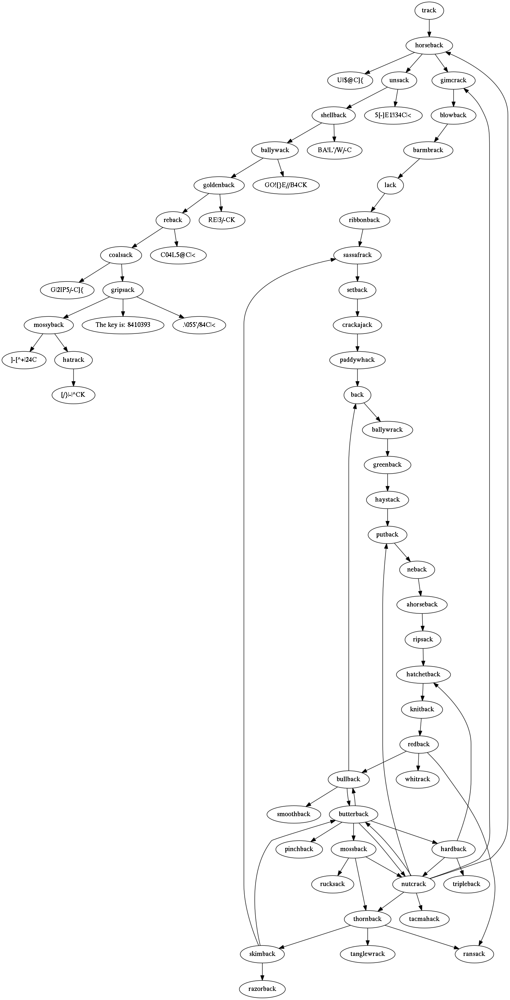

# [Hack Dat Kiwi CTF 2015](https://hack.dat.kiwi/): Leet Maze

**Category:** Forensics
**Points:** 250
**Solves:** 39
**Description:**

> We found a malware that communicates with track.dat.kiwi, however, there's nothing on track.dat.kiwi! It appears that they have established a complicated network of DNS records to point to the C&amp;C server.
> 
> 
> It's basically like CNAME, the software follows track.dat.kiwi to find out the target server. However, there are some caveats.

## writeup (with a nice plot of the maze ;) )

Querying the DNS TXT record of `track.dat.kiwi`
(e.g. with the [`dig`](https://en.wikipedia.org/wiki/Dig_%28command%29)
utility) gives new `.dat.kiwi` hosts which can be queried again for
another `.dat.kiwi` hosts. This builds up a *maze* which can be
interpreted as a digraph with the hosts as a point set and the
hosts specified in the DNS TXT record connected to the appropriate host
as the edges.

The only caveat (mentioned in the description) is that there are
DNS TXT records spelled using the
[Leet alphabet](https://en.wikipedia.org/wiki/Leet) which must be
translated to ASCII. This means that if we find for example `U||$@C]{`,
it must be translated to `unsack` when looking up the new host
(graph point).

Building up the maze (digraph) manually is hard, so an appropriate
algorithm e.g.
[Depth-first search](https://en.wikipedia.org/wiki/Depth-first_search)
should be used.

It is scripted here in bash: [dfs-maze.sh](dfs-maze.sh).

This bash script traverses the whole maze using the
[DFS algorithm](https://en.wikipedia.org/wiki/Graph_traversal#Depth-first_search),
and this way the flag can be found
in one of the DNS TXT records: `The key is: 8410393`.

Moreover, while traversing the maze, this bash script creates
the digraph structure as a [text file](leetmaze.gv)
suitable for the [Graphviz](http://www.graphviz.org/)
Graph Visualization Software. With Graphviz, the graph
can be displayed as a nice graphics:

