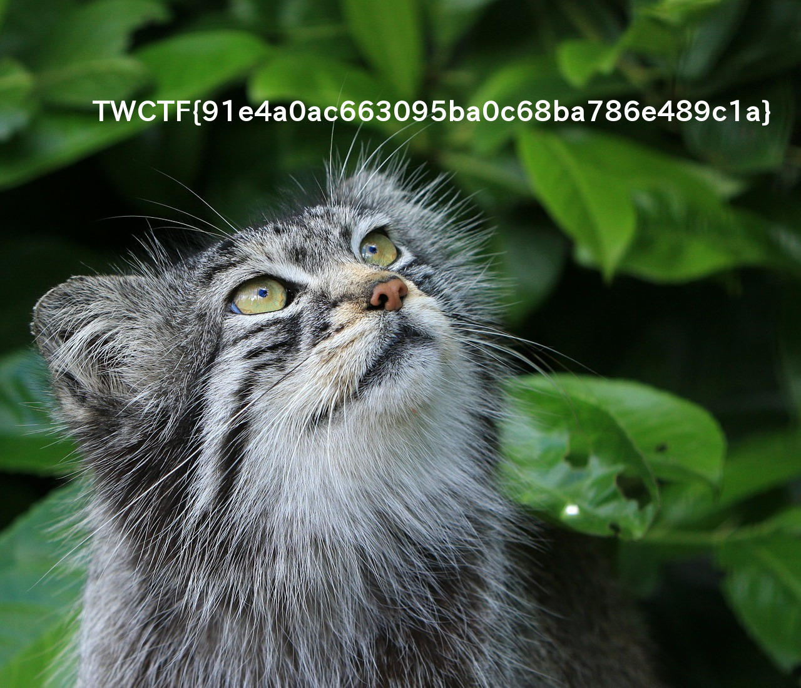

# [Tokyo Westerns / MMA CTF 2nd 2016](https://score.ctf.westerns.tokyo/): [Rescue Data 1: deadnas](https://score.ctf.westerns.tokyo/problems/5?locale=en)

**Category:** Forensic, Warmup
**Points:** 50
**Solves:** 57
**Description:**

> Today, our 3-disk NAS has failed. Please recover flag.
> [deadnas.7z](./deadnas.7z)


## writeup

Despite this is an easy, warmup challenge (in a quite hard CTF),
only 57/835 teams solved it successfully. This means that not
everyone is familiar with RAID structures, so here is a short writeup.

Unzipping [deadnas.7z](./deadnas.7z) we have 3 disk images:
disk0, disk1 and disk2. disk0 and disk2 are 524288 bytes length
disk image-like files, but disk1 has just the string "crashed :-("
instead of valuable data.

Because these disks are from a NAS device, it is presumable
that the disks have a RAID array structure. Furthermore,
we have 3 disks, so it is also presumable that the array
is a commonly used
[RAID5](https://en.wikipedia.org/wiki/Standard_RAID_levels#RAID_5)
array. (Officially released hints in the CTF later confirmed
these reasonable assumptions.)

A RAID5 array with `n` identical `c` capacity disks allow us to
store `(n-1)*c` size data. Upon failure of a single drive in the array, the
redundancy allow us to rebuild the RAID and/or rescue the data.
However, the parity (redundancy) information is not stored on
a dedicated disk, but it is "striped" across all of the volumes
(to speed up the array).

Here is a short table to understand the structure of a
RAID5 array (with 3 disks, but it can be generalized to >=3):

|stripe no.|disk0|disk1|disk2|
|:--------:|:---:|:---:|:---:|
|1         |A0   |A1   | Ap  |
|2         |B0   |Bp   | B2  |
|3         |Cp   |C1   | C2  |
|4         |D0   |D1   | Dp  |

So the `?p` are parity blocks, the others are the data blocks.
Reading should be done row-by-row:

```
A0 -> A1 -> B0 -> B2 -> C1 -> C2 -> D0 -> D1 -> ...
```

The parity block can be calculated by xoring the data in the
stripe:

```
Ap = A0 ^ A1
Bp = B0 ^ B2
Cp = C1 ^ C2
Dp = D0 ^ D1
...
```

So if e.g. disk1 has been crashed, the whole disk can be rescued
by `disk1 = disk0 ^ disk2`. Or if we want just the valuable data,
then we can use the following scheme:

```
A0 -> A1 = A0^Ap -> B0 -> B1 -> C1 = Cp^C2 -> C2 -> D0 -> D1 = D0^Dp -> ...
```

It is easy to implement, the only thing to know is the stripe block
size. It is some power of 2 (e.g. 256/512/1024/... bytes) and can be
estimated by reading and identifying the continuous data blocks.
E.g. disk0 contains `A0, B0, Cp, D0, E0, Fp, ...`, so it the
continuous data block size is twice the stripe size. Here it is
approx. ~1024 bytes, so the strip block size should be 512.

The Python script [rescue_raid5.py](./rescue_raid5.py) here in the repo
does the job quickly: takes disk0 and disk2, and generates the
healthy and mountable [disk_rescue](./disk_rescue) image file. There is a
[flag.jpg](./flag.jpg) in the image which contains the flag.



P.S.: participated in the
[OpenToAll (great!) team](https://score.ctf.westerns.tokyo/teams/8?locale=en), finished at rank 16th / 835.
